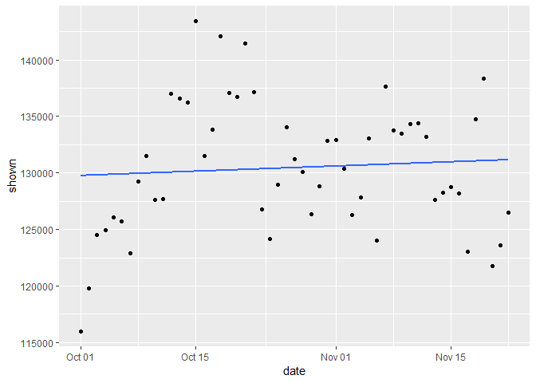
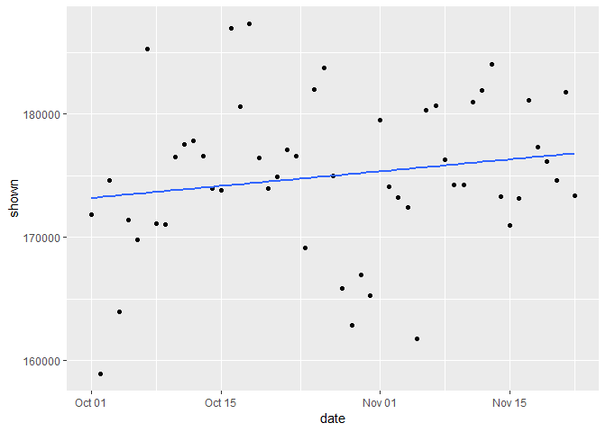
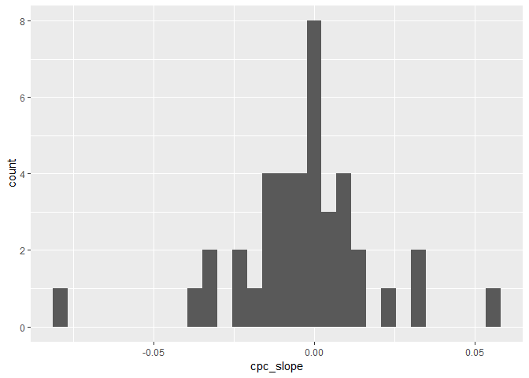

Ads Analysis
================
Siddhartha Jetti
July 17, 2019

Goal
====

Maybe the first industry to heavily rely on data science was the online ads industry. Data Science is used to choose which ads to show, how much to pay, optimize the ad text and the position as well as in countless of other related applications.

Optimizing ads is one of the most intellectually challenging jobs a data scientist can do. It is a really complex problem given the huge (really really huge) size of the datasets as well as number of features that can be used. Moreover, companies often spend huge amounts of money in ads and a small ad optimization improvement can be worth millions of dollars for the company.

The goal of this project is to look at a few ad campaigns and analyze their current performance as well as predict their future performance.

Challenge Description
=====================

Company XYZ is a food delivery company. Like pretty much any other site, in order to get customers, they have been relying significantly on online ads, such as those you see on Google or Facebook.

At the moment, they are running 40 different ad campaigns and want you to help them understand their performance.

Specifically, you are asked to:

1.  If you had to identify the 5 best ad groups, which ones would be? Which metric did you choose to identify the best ones? Why? Explain the pros of your metric as well as the possible cons. From a business perspective, choosing that metric implies that you are focusing on what?

2.  For each group, predict how many ads will be shown on Dec, 15 (assume each ad group keeps following its trend).

3.  Cluster ads into 3 groups: the ones whose avg\_cost\_per\_click is going up, the ones whose avg\_cost\_per\_click is flat and the ones whose avg\_cost\_per\_click is going down.

Data
----

We have 1 table downloadable by clicking here.

The table is:

ad\_table - aggregate information about ads

### Columns:

-   date : all data are aggregated by date
-   shown : the number of ads shown on a given day all over the web. Impressions are free. That is, companies pay only if a user clicks on the ad, not to show it
-   clicked : the number of clicks on the ads. This is what companies pay for. By clicking on the ad, the user is brought to the site converted : the number of conversions on the site coming from ads. To be counted, a conversion as to happen on the same day as the ad click.
-   avg\_cost\_per\_click : on an average, how much it cost each of those clicks
-   total\_revenue : how much revenue came from the conversions
-   ad : we have several different ad versions with different text. This shows which ad group we are considering

Problem Setup
=============

``` r
# Load required libraries
library(dplyr)
```

    ## 
    ## Attaching package: 'dplyr'

    ## The following objects are masked from 'package:stats':
    ## 
    ##     filter, lag

    ## The following objects are masked from 'package:base':
    ## 
    ##     intersect, setdiff, setequal, union

``` r
library(ggplot2)
```

    ## Registered S3 methods overwritten by 'ggplot2':
    ##   method         from 
    ##   [.quosures     rlang
    ##   c.quosures     rlang
    ##   print.quosures rlang

``` r
library(lubridate)
```

    ## 
    ## Attaching package: 'lubridate'

    ## The following object is masked from 'package:base':
    ## 
    ##     date

``` r
library(randomForest)
```

    ## randomForest 4.6-14

    ## Type rfNews() to see new features/changes/bug fixes.

    ## 
    ## Attaching package: 'randomForest'

    ## The following object is masked from 'package:ggplot2':
    ## 
    ##     margin

    ## The following object is masked from 'package:dplyr':
    ## 
    ##     combine

``` r
# Read in the input data into a dataframe
ads <- read.csv("ad_table.csv", stringsAsFactors = F) 
```

Data Exploration
================

Explore the ads dataset

``` r
# Transform variables in ads dataset
ads <- ads %>%
  mutate(date = as.Date(date)) %>%
  arrange(ad, date)

# Check data types of each of the columns
summary(ads)
```

    ##       date                shown           clicked        converted     
    ##  Min.   :2015-10-01   Min.   :     0   Min.   :    0   Min.   :   0.0  
    ##  1st Qu.:2015-10-14   1st Qu.: 28031   1st Qu.:  744   1st Qu.:  18.0  
    ##  Median :2015-10-27   Median : 54029   Median : 1392   Median :  41.0  
    ##  Mean   :2015-10-27   Mean   : 68300   Mean   : 3056   Mean   : 126.5  
    ##  3rd Qu.:2015-11-09   3rd Qu.: 97315   3rd Qu.: 3366   3rd Qu.: 103.0  
    ##  Max.   :2015-11-22   Max.   :192507   Max.   :20848   Max.   :1578.0  
    ##  avg_cost_per_click total_revenue          ad           
    ##  Min.   :0.000      Min.   : -200.2   Length:2115       
    ##  1st Qu.:0.760      1st Qu.:  235.5   Class :character  
    ##  Median :1.400      Median :  553.3   Mode  :character  
    ##  Mean   :1.374      Mean   : 1966.5                     
    ##  3rd Qu.:1.920      3rd Qu.: 1611.5                     
    ##  Max.   :4.190      Max.   :39623.7

``` r
# Take a peek at data
head(ads)
```

    ##         date shown clicked converted avg_cost_per_click total_revenue
    ## 1 2015-10-01 65877    2339        43               0.90        641.62
    ## 2 2015-10-02 65100    2498        38               0.94        756.37
    ## 3 2015-10-03 70658    2313        49               0.86        970.90
    ## 4 2015-10-04 69809    2833        51               1.01        907.39
    ## 5 2015-10-05 68186    2696        41               1.00        879.45
    ## 6 2015-10-06 66864    2617        46               0.98        746.48
    ##           ad
    ## 1 ad_group_1
    ## 2 ad_group_1
    ## 3 ad_group_1
    ## 4 ad_group_1
    ## 5 ad_group_1
    ## 6 ad_group_1

Removing rows with shown = 0 or revenue &lt; 0

``` r
ads_cleaned <- ads %>%
  filter(shown > 0, clicked > 0, total_revenue >= 0)
```

Now, checking the summary of dataset

``` r
summary(ads_cleaned)
```

    ##       date                shown           clicked          converted     
    ##  Min.   :2015-10-01   Min.   :  7494   Min.   :  187.0   Min.   :   0.0  
    ##  1st Qu.:2015-10-14   1st Qu.: 28446   1st Qu.:  756.5   1st Qu.:  18.0  
    ##  Median :2015-10-27   Median : 54569   Median : 1413.0   Median :  42.0  
    ##  Mean   :2015-10-26   Mean   : 68854   Mean   : 3088.7   Mean   : 127.8  
    ##  3rd Qu.:2015-11-09   3rd Qu.:100396   3rd Qu.: 3413.5   3rd Qu.: 106.0  
    ##  Max.   :2015-11-22   Max.   :192507   Max.   :20848.0   Max.   :1578.0  
    ##  avg_cost_per_click total_revenue          ad           
    ##  Min.   :0.080      Min.   :    0.0   Length:2091       
    ##  1st Qu.:0.780      1st Qu.:  244.8   Class :character  
    ##  Median :1.410      Median :  561.1   Mode  :character  
    ##  Mean   :1.388      Mean   : 1989.2                     
    ##  3rd Qu.:1.920      3rd Qu.: 1634.9                     
    ##  Max.   :4.190      Max.   :39623.7

Check for missing values in the data.

``` r
# count of missing values by column in views dataset
colSums(is.na(ads_cleaned))
```

    ##               date              shown            clicked 
    ##                  0                  0                  0 
    ##          converted avg_cost_per_click      total_revenue 
    ##                  0                  0                  0 
    ##                 ad 
    ##                  0

No missing values exist anywhere in the data.

Check if data exists for all the ads for all the dates.

``` r
table(ads_cleaned$date)
```

    ## 
    ## 2015-10-01 2015-10-02 2015-10-03 2015-10-04 2015-10-05 2015-10-06 
    ##         40         38         39         40         40         40 
    ## 2015-10-07 2015-10-08 2015-10-09 2015-10-10 2015-10-11 2015-10-12 
    ##         39         40         39         40         40         39 
    ## 2015-10-13 2015-10-14 2015-10-15 2015-10-16 2015-10-17 2015-10-18 
    ##         40         39         40         39         40         40 
    ## 2015-10-19 2015-10-20 2015-10-21 2015-10-22 2015-10-23 2015-10-24 
    ##         39         40         40         40         40         40 
    ## 2015-10-25 2015-10-26 2015-10-27 2015-10-28 2015-10-29 2015-10-30 
    ##         39         38         40         39         39         40 
    ## 2015-10-31 2015-11-01 2015-11-02 2015-11-03 2015-11-04 2015-11-05 
    ##         40         39         40         40         38         39 
    ## 2015-11-06 2015-11-07 2015-11-08 2015-11-09 2015-11-10 2015-11-11 
    ##         40         39         40         40         40         38 
    ## 2015-11-12 2015-11-13 2015-11-14 2015-11-15 2015-11-16 2015-11-17 
    ##         39         40         40         38         40         40 
    ## 2015-11-18 2015-11-19 2015-11-20 2015-11-21 2015-11-22 
    ##         39         38         39         39         40

``` r
table(ads_cleaned$ad)
```

    ## 
    ##  ad_group_1 ad_group_10 ad_group_11 ad_group_12 ad_group_13 ad_group_14 
    ##          53          52          49          51          51          52 
    ## ad_group_15 ad_group_16 ad_group_17 ad_group_18 ad_group_19  ad_group_2 
    ##          53          51          53          52          52          53 
    ## ad_group_20 ad_group_21 ad_group_22 ad_group_23 ad_group_24 ad_group_25 
    ##          51          51          53          50          52          52 
    ## ad_group_26 ad_group_27 ad_group_28 ad_group_29  ad_group_3 ad_group_30 
    ##          53          52          53          52          53          53 
    ## ad_group_31 ad_group_32 ad_group_33 ad_group_34 ad_group_35 ad_group_36 
    ##          53          53          53          53          53          53 
    ## ad_group_37 ad_group_38 ad_group_39  ad_group_4 ad_group_40  ad_group_5 
    ##          53          53          53          51          52          52 
    ##  ad_group_6  ad_group_7  ad_group_8  ad_group_9 
    ##          53          53          53          53

Overall the data looks good.

Question 1:
===========

Here the goal is to choose the best 5 ads based on the provided data. I plan on using average return on advertising budget as a metric to choose the top ad campaigns.

``` r
# calculate average daily return for every ad
best_ads_avg_revenue <- ads_cleaned %>%
  group_by(ad) %>%
  summarise(avg_return =  sum(total_revenue) / sum(clicked * avg_cost_per_click)) %>%
  arrange(desc(avg_return)) 

head(best_ads_avg_revenue, 5)
```

    ## # A tibble: 5 x 2
    ##   ad          avg_return
    ##   <chr>            <dbl>
    ## 1 ad_group_31       8.52
    ## 2 ad_group_2        2.36
    ## 3 ad_group_16       2.35
    ## 4 ad_group_14       1.77
    ## 5 ad_group_27       1.26

The problem with using average return as a metric is, it does not identify the ads with low average return but are consistently trending up. Arguably, the ads that are trending up are equally important to marketing teams, if not more, than the ones with high average return and trending down. So, it makes sense to look both the average return and the trend to know the complete story.

``` r
# Function to extract trend in the data
slope_trendline <- function(y, x) {
  trendline <- lm(formula = y ~ x)
  return(trendline$coefficients[2])
}

# Function to compute the p-valuye of x coefficient
slope_p_value <- function(y, x) {
  trendline <- lm(formula = y ~ x)
  df <- data.frame(summary(trendline)$coefficients)
  return(df[2,4])
}

# Estimate the trend over time for every ad
best_ads <- ads_cleaned %>%
  group_by(ad) %>%
  mutate(date = as.numeric(date),
         day_return =  total_revenue / (clicked * avg_cost_per_click)) %>%
  summarise(trend = slope_trendline(day_return, date)) %>%
  inner_join(best_ads_avg_revenue, by = "ad") %>%
  arrange(desc(avg_return))

head(best_ads, 10)
```

    ## # A tibble: 10 x 3
    ##    ad              trend avg_return
    ##    <chr>           <dbl>      <dbl>
    ##  1 ad_group_31  0.0227        8.52 
    ##  2 ad_group_2  -0.00140       2.36 
    ##  3 ad_group_16 -0.0102        2.35 
    ##  4 ad_group_14  0.00662       1.77 
    ##  5 ad_group_27  0.00347       1.26 
    ##  6 ad_group_36  0.000531      0.910
    ##  7 ad_group_15 -0.00122       0.877
    ##  8 ad_group_22 -0.000204      0.867
    ##  9 ad_group_13 -0.000835      0.853
    ## 10 ad_group_34  0.00103       0.772

All the top 5 ad campaigns by average return are making money (return &gt; 1). Among them, The ad groups 31, 16 and 14 are having a positive trend. While groups 2 and 16 have high average return but are trending down.

Question 2:
===========

Here the goal is to predict how many times the ad will be shown on a future date.

The simplest method is to fit a straight line that is closest to the data points for each ad group and use it to predict future views.

Let's pick few arbitrary videos and visualize the time series of views.

``` r
ads_cleaned %>%
  filter(ad == "ad_group_31") %>%

ggplot(aes(date, shown)) +
  geom_point() +
  geom_smooth(method = "lm", se = FALSE)
```



``` r
ads_cleaned %>%
  filter(ad == "ad_group_38") %>%

ggplot(aes(date, shown)) +
  geom_point() +
  geom_smooth(method = "lm", se = FALSE)
```



Fitting a line to time series of all the ad campaigns

``` r
unique_ads <- unique(ads_cleaned$ad)
new <- data.frame(x = as.numeric(as.Date("2015-12-15")))
prediction <- data.frame(ad = c(), prediction = c())

for(i in unique_ads) {
  x <- as.numeric(ads_cleaned$date[ads_cleaned$ad == i])
  y <- ads_cleaned$shown[ads_cleaned$ad == i]
  predicted <- round(predict(lm(y ~ x), newdata = new), digits = 0)
  predicted_df <- data.frame(ad = i, prediction = predicted, stringsAsFactors = F)
  prediction <- bind_rows(prediction, predicted_df)
}

head(prediction)
```

    ##            ad prediction
    ## 1  ad_group_1      72513
    ## 2 ad_group_10     134652
    ## 3 ad_group_11      21957
    ## 4 ad_group_12      30828
    ## 5 ad_group_13     162207
    ## 6 ad_group_14       8925

Question 3:
===========

First fit a linear regression line to extract the trend from data.

``` r
# Function to normalize the variables
normalize <- function(x) {
    return((x - min(x)) / (max(x) - min(x)))
}

# Now group by video id, normalize variables and extract slope
ads_cpc_summary <- ads_cleaned %>%
  mutate(date = as.numeric(date),
         cpc_norm = normalize(avg_cost_per_click),
         date_norm = normalize(date)) %>%
  group_by(ad) %>%
  summarise(cpc_slope = slope_trendline(cpc_norm, date_norm),
            cpc_slope_p_value = slope_p_value(cpc_norm, date_norm))

# Take a look at the data
head(ads_cpc_summary)
```

    ## # A tibble: 6 x 3
    ##   ad          cpc_slope cpc_slope_p_value
    ##   <chr>           <dbl>             <dbl>
    ## 1 ad_group_1    0.0117              0.145
    ## 2 ad_group_10  -0.00204             0.861
    ## 3 ad_group_11   0.00620             0.656
    ## 4 ad_group_12   0.0109              0.495
    ## 5 ad_group_13   0.00251             0.875
    ## 6 ad_group_14  -0.00982             0.168

The distribution of slopes of cost per click trendlines

``` r
quantile(ads_cpc_summary$cpc_slope, probs = seq(0, 1, by = 0.05)) 
```

    ##            0%            5%           10%           15%           20% 
    ## -0.0806114848 -0.0342062907 -0.0241105449 -0.0180763565 -0.0131060504 
    ##           25%           30%           35%           40%           45% 
    ## -0.0123932091 -0.0099443006 -0.0073768587 -0.0058552568 -0.0033748870 
    ##           50%           55%           60%           65%           70% 
    ## -0.0017400396 -0.0008500476  0.0001754681  0.0012241962  0.0032963406 
    ##           75%           80%           85%           90%           95% 
    ##  0.0066245909  0.0087668688  0.0110190582  0.0154277409  0.0310359251 
    ##          100% 
    ##  0.0538748361

``` r
ads_cpc_summary %>%
  ggplot() +
  geom_histogram(bins = 30, aes(x = cpc_slope)) 
```



Trends are extracted by fitting a inear regression line to time series of avereage cost per click data. Here are rules that can be thought of to classify ads based on if average cost per click are going up, staying flat or going down.

-   If coefficient of x-term is statistically significant and coefficient &gt; 0, then average cost per clicks are going up.
-   If coefficient is statistically significant and coefficient &lt; 0, then average cost per clicks are going down.
-   If coefficient is NOT statistically significant then average cost per clicks are flat.

The criterion to decide statistical significance should not be just p &lt; 0.05. The reason is we are effectively doing 40 different tests. So, to prevent risk of incorrectly rejecting a null hypothesis due to multiple comparisons, the p-values of each test need to be adjusted using Boniferoni correction (pvalue/number of comparisons).

``` r
# Classifying ads based on the stated rules
ads_cpc_summary <- ads_cpc_summary %>%
  mutate(cpc_category = case_when(
                      cpc_slope_p_value < (0.05/40) & cpc_slope > 0 ~ "Going up",
                      cpc_slope_p_value < (0.05/40) & cpc_slope < 0 ~ "Going down",
                      TRUE ~ "Flat")
  )

# Frequency of different video categories
table(ads_cpc_summary$cpc_category)
```

    ## 
    ## Flat 
    ##   40

Employing Boniferoni correction is classifying all the campaigns as average cost per click remaining Flat. The reason being Boniferoni correction generally imposes a very stringent condition for significance.
