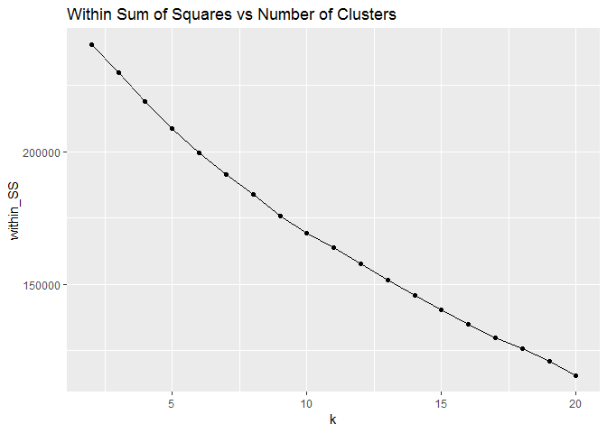

Clustering Grocery Items
================
Siddhartha Jetti
7/25/2019

Goal
====

Online shops often sell tons of different items and this can become messy very quickly!

Data science can be extremely useful to automatically organize the products in categories so that they can be easily found by the customers.

The goal of this challenge is to look at user purchase history and create categories of items that are likely to be bought together and, therefore, should belong to the same cluster.

Challenge Description
=====================

Company XYZ is an online grocery store. In the current version of the website, they have manually grouped the items into a few categories based on their experience.

However, they now have a lot of data about user purchase history. Therefore, they would like to put the data into use!

This is what they asked you to do:

1)The company founder wants to meet with some of the best customers to go through a focus group with them. You are asked to send the ID of the following customers to the founder:

-   the customer who bought the most items overall in her lifetime

-   for each item, the customer who bought that product the most

2)Cluster items based on user co-purchase history. That is, create clusters of products that have the highest probability of being bought together. The goal of this is to replace the old/manually created categories with these new ones. Each item can belong to just one cluster.

Data
====

We have 2 table downloadable by clicking on here.

The 2 tables are:

item\_to\_id - for each item, it gives the corresponding id

Columns:
--------

-   Item\_name : The name of the item
-   Item\_id : the id of the item. Can be joined to the id in the other table. It is unique by item.

purchase\_history - for each user purchase, the items bought

Columns:
--------

-   user\_id : The id of the user.
-   id : comma-separated list of items bought together in that transaction.

Problem Setup
=============

``` r
# Load required libraries
library(tidyverse)
```

    ## Registered S3 methods overwritten by 'ggplot2':
    ##   method         from 
    ##   [.quosures     rlang
    ##   c.quosures     rlang
    ##   print.quosures rlang

    ## -- Attaching packages ---------------------------------- tidyverse 1.2.1 --

    ## v ggplot2 3.1.1     v purrr   0.3.2
    ## v tibble  2.1.1     v dplyr   0.8.1
    ## v tidyr   0.8.3     v stringr 1.4.0
    ## v readr   1.3.1     v forcats 0.4.0

    ## -- Conflicts ------------------------------------- tidyverse_conflicts() --
    ## x dplyr::filter() masks stats::filter()
    ## x dplyr::lag()    masks stats::lag()

``` r
library(ggplot2)

# Read and process input data into a dataframe
items <- read.csv("item_to_id.csv", stringsAsFactors = F)
purchases <- read.csv("purchase_history.csv", stringsAsFactors = F)
```

Data Exploration
================

Check data types of columns in items dataset

``` r
# Check data types of each of the columns
str(items)
```

    ## 'data.frame':    48 obs. of  2 variables:
    ##  $ Item_name: chr  "coffee" "tea" "juice" "soda" ...
    ##  $ Item_id  : int  43 23 38 9 39 37 34 13 28 26 ...

``` r
summary(items)
```

    ##   Item_name            Item_id     
    ##  Length:48          Min.   : 1.00  
    ##  Class :character   1st Qu.:12.75  
    ##  Mode  :character   Median :24.50  
    ##                     Mean   :24.50  
    ##                     3rd Qu.:36.25  
    ##                     Max.   :48.00

Check data types of columns in purchases dataset.

``` r
# Check data types of each of the columns
str(purchases)
```

    ## 'data.frame':    39474 obs. of  2 variables:
    ##  $ user_id: int  222087 1343649 404134 1110200 224107 409803 1296632 748280 31625 987613 ...
    ##  $ id     : chr  "27,26" "6,47,17" "18,12,23,22,27,43,38,20,35,1" "9,23,2,20,26,47,37" ...

``` r
summary(purchases)
```

    ##     user_id             id           
    ##  Min.   :     47   Length:39474      
    ##  1st Qu.: 373567   Class :character  
    ##  Median : 753584   Mode  :character  
    ##  Mean   : 752015                     
    ##  3rd Qu.:1124939                     
    ##  Max.   :1499974

Check for missing values in the data

``` r
# Check if any missing values exist
colSums(is.na(items))
```

    ## Item_name   Item_id 
    ##         0         0

``` r
colSums(is.na(purchases))
```

    ## user_id      id 
    ##       0       0

Check for duplicates in the data

``` r
# check if any duplicate item id exist
length(items$Item_id) == length(unique(items$Item_id))
```

    ## [1] TRUE

``` r
# check if any duplicate user id exist
length(purchases$user_id) == length(unique(purchases$user_id))
```

    ## [1] FALSE

Clearly, there are duplicate user ids in purchases dataset. This is OK because single user can make multiple transactions.

It is important to have an unique id for each transaction. Now lets create transaction id using the user id in purchases dataset.

``` r
purchases <- purchases %>%
  group_by(user_id) %>%
  mutate(transaction_id = paste0(user_id, "_", row_number())) 

# Take a peek at the data
head(purchases)
```

    ## # A tibble: 6 x 3
    ## # Groups:   user_id [6]
    ##   user_id id                                                 transaction_id
    ##     <int> <chr>                                              <chr>         
    ## 1  222087 27,26                                              222087_1      
    ## 2 1343649 6,47,17                                            1343649_1     
    ## 3  404134 18,12,23,22,27,43,38,20,35,1                       404134_1      
    ## 4 1110200 9,23,2,20,26,47,37                                 1110200_1     
    ## 5  224107 31,18,5,13,1,21,48,16,26,2,44,32,20,37,42,35,40,4~ 224107_1      
    ## 6  409803 43,29,8,37,23,45                                   409803_1

``` r
# Check if created transaction ids are unique
length(purchases$transaction_id) == length(unique(purchases$transaction_id))
```

    ## [1] TRUE

Overall the data looks good.

Question 1
==========

``` r
# Get maximum number of items purchased in a single transaction
# This is done by counting the occurences of "," + 1
max_items <- max(str_count(purchases$id, ",")) + 1
```

Now transform purchases dataset into tidy format for future use.

``` r
purchases_tidy <- purchases %>%
  separate(col = id, into = paste0("item", 1:max_items), sep = ",") %>%
  gather(key = "value", value = "item_id", -user_id, -transaction_id) %>%
  filter(!is.na(item_id)) %>%
  mutate(item_id = as.integer(item_id))
```

    ## Warning: Expected 27 pieces. Missing pieces filled with `NA` in 39472
    ## rows [1, 2, 3, 4, 5, 6, 7, 8, 9, 10, 11, 12, 13, 14, 15, 16, 17, 18, 19,
    ## 20, ...].

``` r
head(purchases_tidy)
```

    ## # A tibble: 6 x 4
    ## # Groups:   user_id [6]
    ##   user_id transaction_id value item_id
    ##     <int> <chr>          <chr>   <int>
    ## 1  222087 222087_1       item1      27
    ## 2 1343649 1343649_1      item1       6
    ## 3  404134 404134_1       item1      18
    ## 4 1110200 1110200_1      item1       9
    ## 5  224107 224107_1       item1      31
    ## 6  409803 409803_1       item1      43

Get user id that made the most number of purchases in the life time.

``` r
most_units_bought <- purchases_tidy %>%
  group_by(user_id) %>%
  summarise(units_bought = n()) %>%
  arrange(desc(units_bought)) %>%
  filter(row_number() == 1)

# user id with most number of purchases
most_units_bought
```

    ## # A tibble: 1 x 2
    ##   user_id units_bought
    ##     <int>        <int>
    ## 1  269335           72

Get user ids with most units bought by product.

``` r
most_units_by_item <- purchases_tidy %>%
  group_by(item_id, user_id) %>%
  summarise(units_bought = n()) %>%
  arrange(item_id, desc(units_bought)) %>%
  filter(row_number() == 1) %>%
  inner_join(items, by = c("item_id" = "Item_id")) 

# user id with most number of purchases by item
most_units_by_item
```

    ## # A tibble: 48 x 4
    ## # Groups:   item_id [48]
    ##    item_id user_id units_bought Item_name    
    ##      <int>   <int>        <int> <chr>        
    ##  1       1   31625            4 sugar        
    ##  2       2   31625            5 lettuce      
    ##  3       3  154960            4 pet items    
    ##  4       4    5289            3 baby items   
    ##  5       5  217277            3 waffles      
    ##  6       6  334664            4 poultry      
    ##  7       7  175865            3 sandwich bags
    ##  8       8  151926            3 butter       
    ##  9       9  269335            4 soda         
    ## 10      10  618914            4 carrots      
    ## # ... with 38 more rows

Question 2
==========

Now the goal is to create clusters of items that have highest probability of being purchased together.

Each grocery item can be imagined as a point in the n-dimensional space spun by transactions. Each coordinate of the point(n-dimensional) would be the number of units of the item purchased in transaction corresponding to the coordinate.

``` r
# Build item-transaction matrix
item_transaction_matrix <- purchases_tidy %>%
  group_by(transaction_id, item_id) %>%
  summarise(nunits = n()) %>%
  ungroup() %>%
  spread(transaction_id, nunits) %>%
  mutate_all(list(~replace_na(., 0))) 

head(item_transaction_matrix)
```

    ## # A tibble: 6 x 39,475
    ##   item_id `100002_1` `1000074_1` `1000074_2` `1000074_3` `100009_1`
    ##     <dbl>      <dbl>       <dbl>       <dbl>       <dbl>      <dbl>
    ## 1       1          0           0           0           0          0
    ## 2       2          0           1           0           0          0
    ## 3       3          0           0           0           0          0
    ## 4       4          0           0           0           0          0
    ## 5       5          0           0           0           0          0
    ## 6       6          0           0           0           0          1
    ## # ... with 39,469 more variables: `100009_2` <dbl>, `1000096_1` <dbl>,
    ## #   `1000103_1` <dbl>, `1000103_2` <dbl>, `1000103_3` <dbl>,
    ## #   `1000103_4` <dbl>, `1000107_1` <dbl>, `1000107_2` <dbl>,
    ## #   `1000145_1` <dbl>, `1000236_1` <dbl>, `1000236_2` <dbl>,
    ## #   `1000236_3` <dbl>, `1000256_1` <dbl>, `1000289_1` <dbl>,
    ## #   `1000296_1` <dbl>, `1000355_1` <dbl>, `1000355_2` <dbl>,
    ## #   `1000359_1` <dbl>, `1000499_1` <dbl>, `1000584_1` <dbl>,
    ## #   `1000584_2` <dbl>, `1000656_1` <dbl>, `1000664_1` <dbl>,
    ## #   `1000664_2` <dbl>, `1000679_1` <dbl>, `1000683_1` <dbl>,
    ## #   `1000683_2` <dbl>, `1000683_3` <dbl>, `1000683_4` <dbl>,
    ## #   `1000840_1` <dbl>, `1000841_1` <dbl>, `1000841_2` <dbl>,
    ## #   `1000841_3` <dbl>, `1000841_4` <dbl>, `1000847_1` <dbl>,
    ## #   `1000857_1` <dbl>, `1000931_1` <dbl>, `1000961_1` <dbl>,
    ## #   `1000961_2` <dbl>, `1000961_3` <dbl>, `1001046_1` <dbl>,
    ## #   `1001170_1` <dbl>, `1001170_2` <dbl>, `1001282_1` <dbl>,
    ## #   `1001282_2` <dbl>, `1001282_3` <dbl>, `1001282_4` <dbl>,
    ## #   `1001334_1` <dbl>, `100134_1` <dbl>, `100134_2` <dbl>,
    ## #   `1001381_1` <dbl>, `1001381_2` <dbl>, `1001399_1` <dbl>,
    ## #   `1001410_1` <dbl>, `1001410_2` <dbl>, `1001510_1` <dbl>,
    ## #   `1001598_1` <dbl>, `1001609_1` <dbl>, `1001620_1` <dbl>,
    ## #   `1001709_1` <dbl>, `1001709_2` <dbl>, `1001709_3` <dbl>,
    ## #   `1001737_1` <dbl>, `1001830_1` <dbl>, `1001830_2` <dbl>,
    ## #   `100185_1` <dbl>, `100186_1` <dbl>, `100186_2` <dbl>,
    ## #   `100186_3` <dbl>, `1002136_1` <dbl>, `1002146_1` <dbl>,
    ## #   `100215_1` <dbl>, `1002175_1` <dbl>, `1002176_1` <dbl>,
    ## #   `1002176_2` <dbl>, `1002176_3` <dbl>, `1002237_1` <dbl>,
    ## #   `1002295_1` <dbl>, `1002295_2` <dbl>, `1002356_1` <dbl>,
    ## #   `1002419_1` <dbl>, `1002419_2` <dbl>, `1002440_1` <dbl>,
    ## #   `1002528_1` <dbl>, `1002689_1` <dbl>, `1002709_1` <dbl>,
    ## #   `1002709_2` <dbl>, `100273_1` <dbl>, `100273_2` <dbl>,
    ## #   `1002937_1` <dbl>, `1002937_2` <dbl>, `1002993_1` <dbl>,
    ## #   `1003130_1` <dbl>, `1003130_2` <dbl>, `1003177_1` <dbl>,
    ## #   `100321_1` <dbl>, `1003264_1` <dbl>, `1003292_1` <dbl>,
    ## #   `1003307_1` <dbl>, `1003307_2` <dbl>, ...

To cluster the items based on transaction history, I choose to use Kmeans clustering algorithm. Here the dataset has all the variables on the same scale and pretty much same meaning. So, I expect K-means to perform well. The advantage of using K-means is that it is highly interpretable and can easily be explained.

K-means algorithm chooses the clusters such a way that within cluster variance is minimum for a given number of clusters. The optimal number of clusters is determined by running kmeans with different number of clusters and plotting the Elbow curve (within cluster variance vs number of clusters) and also results should make sense from UI standpoint without containing too many clusters.

For stability, Kmeans algorithm is run multiple times for each configuration of clusters. The mean of variance is used for plotting the elbow curve.

``` r
# Set seed
set.seed(2019)
# Place holder to store within variance for several configuration of clusters
within_SS <- c()
# Try different number of clusters
nclusters <- 2:20
# 10 tries for each configuration of clusters
tries <- 10

# Run Kmeans for different number of clusters
for(i in nclusters){
  tries_within_SS <- c()
  # Run the Kmeans 10 times for each configuration of clusters
  for(try in 1:tries){
    clusters <- kmeans(item_transaction_matrix[,-1], centers = i)
    tries_within_SS <- c(tries_within_SS, clusters$tot.withinss)
  }
  within_SS <- c(within_SS, mean(tries_within_SS))
}
```

Plotting the Elbow curve.

``` r
data.frame(k = nclusters, within_SS = within_SS) %>%
  ggplot(aes(x = k, y = within_SS)) +
  geom_point() +
  geom_line() +
  ggtitle("Within Sum of Squares vs Number of Clusters")
```



Unfortunately, the above plot does not reveal an obvious "elbow" point. But there is a slight change in gradient after k=9 or 10. So, let us choose k = 9 as the optimal number of clusters.

``` r
set.seed(2019)
clusters <- kmeans(item_transaction_matrix[,-1], centers = 9)

item_clusters <- data.frame(item_id = item_transaction_matrix[,1], cluster = clusters$cluster) %>%
  mutate(item_id = as.integer(item_id)) %>%
  inner_join(items, by = c("item_id" = "Item_id")) %>%
  group_by(cluster) %>%
  summarise(item_count = n(), items = paste0(Item_name, collapse = ", "))

item_clusters
```

    ## # A tibble: 9 x 3
    ##   cluster item_count items                                                 
    ##     <int>      <int> <chr>                                                 
    ## 1       1          5 grapefruit, cherries, apples, berries, bananas        
    ## 2       2          1 lettuce                                               
    ## 3       3          3 spaghetti sauce, canned vegetables, ketchup           
    ## 4       4          4 carrots, cucumbers, broccoli, cauliflower             
    ## 5       5          3 poultry, beef, pork                                   
    ## 6       6         22 baby items, waffles, sandwich bags, butter, cereals, ~
    ## 7       7          2 sugar, pet items                                      
    ## 8       8          4 bagels, tortillas, dinner rolls, sandwich loaves      
    ## 9       9          4 soda, tea, juice, coffee

Looking at the item clusters.

-   All the vegetables except lettuce are together.
-   All fruits are grouped together.
-   All kinds of meat are together.
-   Beverages are clustered together.
-   Snacks are grouped.

However, cluster 6 appears to have too many items. Lets try to re-run the algorithm by increasing the number of clusters.

``` r
set.seed(2019)
clusters <- kmeans(item_transaction_matrix[,-1], centers = 12)

item_clusters2 <- data.frame(item_id = item_transaction_matrix[,1], cluster = clusters$cluster) %>%
  mutate(item_id = as.integer(item_id)) %>%
  inner_join(items, by = c("item_id" = "Item_id")) %>%
  group_by(cluster) %>%
  summarise(item_count = n(), items = paste0(Item_name, collapse = ", "))

item_clusters2
```

    ## # A tibble: 12 x 3
    ##    cluster item_count items                                                
    ##      <int>      <int> <chr>                                                
    ##  1       1          5 grapefruit, cherries, apples, berries, bananas       
    ##  2       2          1 lettuce                                              
    ##  3       3          2 bagels, tortillas                                    
    ##  4       4          4 carrots, cucumbers, broccoli, cauliflower            
    ##  5       5          3 poultry, beef, pork                                  
    ##  6       6         17 baby items, waffles, sandwich bags, cereals, shampoo~
    ##  7       7          2 sugar, pet items                                     
    ##  8       8          3 spaghetti sauce, canned vegetables, ketchup          
    ##  9       9          2 soda, juice                                          
    ## 10      10          2 dinner rolls, sandwich loaves                        
    ## 11      11          5 butter, eggs, milk, cheeses, yogurt                  
    ## 12      12          2 tea, coffee

Increasing the number of clusters to 12 resulted in decreasing the maximum number of items in cluster from 22 to 17. It also resulted in breaking out the milk products into different cluster and appears to be performing better than with 9 clusters.
