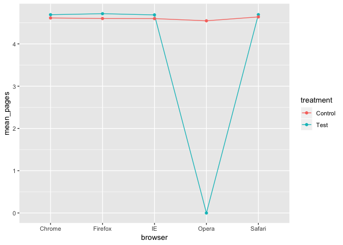
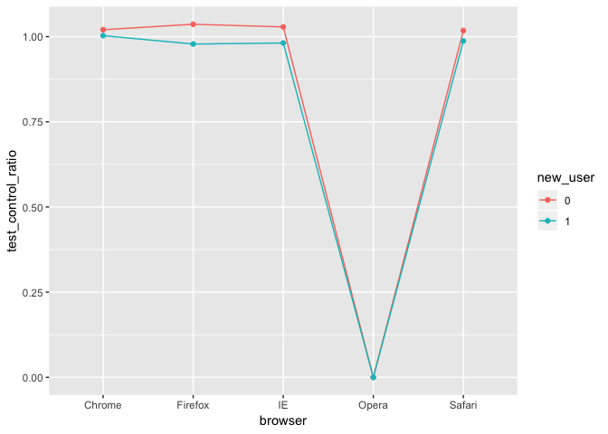

Engagement Test
================
Siddhartha Jetti
October 05, 2019

# Goal

Many sites make money by selling ads. For these sites, the number of
pages visited by users on each session is one of the most important
metric, if not the most important metric.

Data science plays a huge role here, especially by building models to
suggest personalized content. In order to check if the model is actually
improving engagement, companies then run A/B tests. It is often data
scientist responsibility to analyze test data and understand whether the
model has been successful. The goal of this project is to look at A/B
test results and draw conclusions.

# Challenge Description

The company of this exercise is a social network. They decided to add a
feature called: Recommended Friends, i.e. they suggest people you may
know.

A data scientist has built a model to suggest 5 people to each user.
These potential friends will be shown on the user newsfeed. At first,
the model is tested just on a random subset of users to see how it
performs compared to the newsfeed without the new feature.

The test has been running for some time and your boss asks you to check
the results. You are asked to check, for each user, the number of pages
visited during their first session since the test started. If this
number increased, the test is a success.

Specifically, your boss wants to know: \* Is the test winning? That is,
should 100% of the users see the Recommended Friends feature? \* Is the
test performing similarly for all user segments or are there differences
among different segments? \* If you identified segments that responded
differently to the test, can you guess the reason? Would this change
your point 1 conclusions?

# Data

The 2 tables are:

“user\_table” - info about each user sign-up date

### Columns:

  - user\_id : the Id of the user. It is unique by user and can be
    joined to user id in the other table
  - signup\_date : when the user joined the social network

“test\_table” - data about the test results. For each user, we only
consider about how many pages she visited on Jan, 2. The first session
since the date when the test started. That is, if the test started on
Jan 1, and user 1 visited the site on Jan, 2 and Jan, 3, we only care
about how many pages she visited on Jan, 2.

### Columns:

  - user\_id : the Id of the user
  - date : the date of the first session since the test started
  - browser : user browser during that session
  - test: 1 if the user saw the new feature, 0 otherwise
  - pages\_visited: the metric we care about. \# of pages visited in
    that session

# Problem Setup

``` r
# Load required libraries
library(tidyverse)
```

    ## Registered S3 methods overwritten by 'ggplot2':
    ##   method         from 
    ##   [.quosures     rlang
    ##   c.quosures     rlang
    ##   print.quosures rlang

    ## ── Attaching packages ──────────────────────────────────────────────────────────────────────────── tidyverse 1.2.1 ──

    ## ✔ ggplot2 3.1.1     ✔ purrr   0.3.2
    ## ✔ tibble  2.1.1     ✔ dplyr   0.8.1
    ## ✔ tidyr   0.8.3     ✔ stringr 1.4.0
    ## ✔ readr   1.3.1     ✔ forcats 0.4.0

    ## ── Conflicts ─────────────────────────────────────────────────────────────────────────────── tidyverse_conflicts() ──
    ## ✖ dplyr::filter() masks stats::filter()
    ## ✖ dplyr::lag()    masks stats::lag()

``` r
library(ggplot2)

# Read in the input data into a dataframe
users <- read.csv("user_table.csv", stringsAsFactors = F)
test <- read.csv("test_table.csv", stringsAsFactors = F)
```

# Data Exploration

Explore users and test datasets

``` r
# Transform variables into right format
users <- users %>%
  mutate(signup_date = as.Date(signup_date)) %>%
  arrange(user_id, signup_date)

# Check datatypes of all the variables in the users dataset
str(users)
```

    ## 'data.frame':    100000 obs. of  2 variables:
    ##  $ user_id    : int  34 59 178 285 383 397 488 608 656 771 ...
    ##  $ signup_date: Date, format: "2015-01-01" "2015-01-01" ...

``` r
summary(users)
```

    ##     user_id         signup_date        
    ##  Min.   :     34   Min.   :2015-01-01  
    ##  1st Qu.:2271007   1st Qu.:2015-03-08  
    ##  Median :4519576   Median :2015-05-14  
    ##  Mean   :4511960   Mean   :2015-05-11  
    ##  3rd Qu.:6764484   3rd Qu.:2015-07-18  
    ##  Max.   :8999849   Max.   :2015-08-31

``` r
# Transform variables into right format
test <- test %>%
  mutate(date = as.Date(date)) 

# Check datatypes of all the variables in the test dataset
str(test)
```

    ## 'data.frame':    100000 obs. of  5 variables:
    ##  $ user_id      : int  600597 4410028 6004777 5990330 3622310 1806423 5177398 2494813 6377383 1462493 ...
    ##  $ date         : Date, format: "2015-08-13" "2015-08-26" ...
    ##  $ browser      : chr  "IE" "Chrome" "Chrome" "Safari" ...
    ##  $ test         : int  0 1 0 0 0 0 1 0 1 1 ...
    ##  $ pages_visited: int  2 5 8 8 1 5 5 10 1 7 ...

``` r
summary(test)
```

    ##     user_id             date              browser         
    ##  Min.   :     34   Min.   :2015-08-01   Length:100000     
    ##  1st Qu.:2271007   1st Qu.:2015-08-08   Class :character  
    ##  Median :4519576   Median :2015-08-16   Mode  :character  
    ##  Mean   :4511960   Mean   :2015-08-16                     
    ##  3rd Qu.:6764484   3rd Qu.:2015-08-24                     
    ##  Max.   :8999849   Max.   :2015-08-31                     
    ##       test        pages_visited   
    ##  Min.   :0.0000   Min.   : 0.000  
    ##  1st Qu.:0.0000   1st Qu.: 3.000  
    ##  Median :1.0000   Median : 5.000  
    ##  Mean   :0.5015   Mean   : 4.604  
    ##  3rd Qu.:1.0000   3rd Qu.: 6.000  
    ##  Max.   :1.0000   Max.   :17.000

All the columns appear to have legitimate values.

``` r
# Merge the two datasets
data <- users %>%
  inner_join(test, by = "user_id") %>%
  arrange(date, user_id)

# check for any missing values in the merged dataset
colSums(is.na(data))
```

    ##       user_id   signup_date          date       browser          test 
    ##             0             0             0             0             0 
    ## pages_visited 
    ##             0

No missing values exist anywhere in the data.

``` r
# Take a peek at the data
head(data)
```

    ##   user_id signup_date       date browser test pages_visited
    ## 1    1154  2015-01-01 2015-08-01      IE    0             8
    ## 2    5247  2015-01-01 2015-08-01  Chrome    1             1
    ## 3   12672  2015-01-01 2015-08-01 Firefox    1             7
    ## 4   16562  2015-01-01 2015-08-01  Safari    0             3
    ## 5   17228  2015-01-01 2015-08-01  Chrome    0             2
    ## 6   24823  2015-01-01 2015-08-01      IE    1             6

``` r
# Check if duplicates of user id exist 
length(unique(data$user_id)) == length(data$user_id)
```

    ## [1] TRUE

No duplicates in user id exist in the
    dataset.

``` r
unique(data$date)
```

    ##  [1] "2015-08-01" "2015-08-02" "2015-08-03" "2015-08-04" "2015-08-05"
    ##  [6] "2015-08-06" "2015-08-07" "2015-08-08" "2015-08-09" "2015-08-10"
    ## [11] "2015-08-11" "2015-08-12" "2015-08-13" "2015-08-14" "2015-08-15"
    ## [16] "2015-08-16" "2015-08-17" "2015-08-18" "2015-08-19" "2015-08-20"
    ## [21] "2015-08-21" "2015-08-22" "2015-08-23" "2015-08-24" "2015-08-25"
    ## [26] "2015-08-26" "2015-08-27" "2015-08-28" "2015-08-29" "2015-08-30"
    ## [31] "2015-08-31"

Based on the sign-up date, we can know if the user is new or existing
user. Let us classify the user as new, if he/she signed up after the
start of test which is “2015-08-01”.

``` r
data <- data %>%
  mutate(new_user = ifelse(signup_date >= as.Date("2015-08-01"), 1, 0))

table(data$new_user)
```

    ## 
    ##     0     1 
    ## 79999 20001

# Question 1:

Is the test winning? That is, should 100% of the users see the
Recommended Friends feature?

First check the mean number of pages visited across test and control
groups.

``` r
data_summary <- data %>%
  group_by(test) %>%
  summarise(avg_pages_visited = mean(pages_visited))
  
data_summary
```

    ## # A tibble: 2 x 2
    ##    test avg_pages_visited
    ##   <int>             <dbl>
    ## 1     0              4.61
    ## 2     1              4.60

## Check randomization

To decide if the new feature is resulting in higher number of pages
visited, lets run an A/B test on the feature. The correctness of AB test
depends hugely on assigning users to test and control groups at random.
Now, Check if users of different browsers are randomly assigned to test
and control groups.

``` r
data %>%
  group_by(browser, new_user) %>%
  summarise(prop_test = sum(test == 1)/n(), prop_control = sum(test == 0)/n())
```

    ## # A tibble: 10 x 4
    ## # Groups:   browser [5]
    ##    browser new_user prop_test prop_control
    ##    <chr>      <dbl>     <dbl>        <dbl>
    ##  1 Chrome         0     0.506        0.494
    ##  2 Chrome         1     0.505        0.495
    ##  3 Firefox        0     0.495        0.505
    ##  4 Firefox        1     0.500        0.500
    ##  5 IE             0     0.501        0.499
    ##  6 IE             1     0.504        0.496
    ##  7 Opera          0     0.485        0.515
    ##  8 Opera          1     0.450        0.550
    ##  9 Safari         0     0.499        0.501
    ## 10 Safari         1     0.502        0.498

Based on the proportions of test and control groups, Users appears to be
assigned almost randomly between test and control groups.

Now, Run t.test on the test and control
datasets

``` r
t.test(data$pages_visited[data$test == 0], data$pages_visited[data$test == 1])
```

    ## 
    ##  Welch Two Sample t-test
    ## 
    ## data:  data$pages_visited[data$test == 0] and data$pages_visited[data$test == 1]
    ## t = 0.55711, df = 95835, p-value = 0.5775
    ## alternative hypothesis: true difference in means is not equal to 0
    ## 95 percent confidence interval:
    ##  -0.02190997  0.03931178
    ## sample estimates:
    ## mean of x mean of y 
    ##  4.608394  4.599693

The mean of pages visited in test group is lower than the mean for the
control group. The obtained p\_value \> 0.05 implies that the observed
difference in sample means could have been happened out of random
chance. Based on the above data, There is no reason to believe that the
two groups are different and the feature should not be launched for all
the users.

# Question 2:

Is the test performing similarly for all user segments or are there
differences among different segments?

First, Lets plot the mean number of pages visited vs the user browser.

``` r
# Summarize data by test and control groups
data_test_by_browser = data %>%
                    group_by(browser) %>%
                    summarize(Test = mean(pages_visited[test==1]), Control = mean(pages_visited[test==0]))

data_test_by_browser
```

    ## # A tibble: 5 x 3
    ##   browser  Test Control
    ##   <chr>   <dbl>   <dbl>
    ## 1 Chrome   4.69    4.61
    ## 2 Firefox  4.71    4.60
    ## 3 IE       4.69    4.60
    ## 4 Opera    0       4.55
    ## 5 Safari   4.69    4.64

``` r
# Plot the data
data_test_by_browser %>%
  gather(key = treatment, value = mean_pages, -browser) %>%
ggplot(aes(x = browser, y = mean_pages, group = treatment, color = treatment)) +
  geom_line() +
  geom_point()
```

<!-- -->

The average of number of pages visited for test group among users coming
from Opera browser is 0. Something wrong with data.

The average number of pages visited vs new user

``` r
# Summarize data in test and control groups based on new user
data %>%
  group_by(new_user) %>%
  summarize(Test = mean(pages_visited[test==1]), Control = mean(pages_visited[test==0]))
```

    ## # A tibble: 2 x 3
    ##   new_user  Test Control
    ##      <dbl> <dbl>   <dbl>
    ## 1        0  4.62    4.60
    ## 2        1  4.51    4.63

Check the means test vs control for different segments.

``` r
data %>%
  mutate(new_user = as.factor(new_user)) %>%
  group_by(browser, new_user) %>%
  summarize(test_control_ratio  =  mean(pages_visited[test == 1])/mean(pages_visited[test == 0])) %>%
  ggplot(aes(x = browser, y  = test_control_ratio, color = new_user, group = new_user)) +
  geom_line() +
  geom_point()
```

<!-- -->

The plot above reveals the following :

  - The average number of pages visited for test group among users from
    Opera browser is 0.

  - For new users, The test group is consistently underperforming (ratio
    of test vs control less than 1) compared to control group for all
    browsers with exception of Opera.

  - For existing users, The test is performing better that control,
    ratio more than 1, for all browsers except Opera.

Lets run the t-test by segment.

``` r
data %>%
  group_by(browser, new_user) %>%
  summarise(Test = mean(pages_visited[test == 1]), Control = mean(pages_visited[test == 0]),
            Diff = Test - Control,
            p_value = t.test(pages_visited[test == 1], pages_visited[test == 0])$p.value) 
```

    ## # A tibble: 10 x 6
    ## # Groups:   browser [5]
    ##    browser new_user  Test Control    Diff   p_value
    ##    <chr>      <dbl> <dbl>   <dbl>   <dbl>     <dbl>
    ##  1 Chrome         0  4.70    4.61  0.0936 2.29e-  4
    ##  2 Chrome         1  4.65    4.63  0.0135 8.15e-  1
    ##  3 Firefox        0  4.76    4.59  0.167  3.69e-  6
    ##  4 Firefox        1  4.54    4.64 -0.101  2.21e-  1
    ##  5 IE             0  4.72    4.59  0.131  2.67e-  4
    ##  6 IE             1  4.54    4.63 -0.0865 2.81e-  1
    ##  7 Opera          0  0       4.59 -4.59   7.20e-255
    ##  8 Opera          1  0       4.36 -4.36   1.22e- 68
    ##  9 Safari         0  4.72    4.64  0.0827 1.00e-  1
    ## 10 Safari         1  4.58    4.64 -0.0592 6.02e-  1

Based on the test-control differences and p-values, Clearly the test is
performing differently among different segments.

# Question 3:

If you identified segments that responded differently to the test, can
you guess the reason? Would this change your point 1 conclusions?

The above results can be more or less repeated by the multiple linear
regression.

``` r
# Simple Linear regression
model <- lm(pages_visited ~ test, data)
summary(model)
```

    ## 
    ## Call:
    ## lm(formula = pages_visited ~ test, data = data)
    ## 
    ## Residuals:
    ##     Min      1Q  Median      3Q     Max 
    ## -4.5997 -1.6084  0.3916  1.4003 12.3916 
    ## 
    ## Coefficients:
    ##              Estimate Std. Error t value Pr(>|t|)    
    ## (Intercept)  4.608394   0.011054 416.913   <2e-16 ***
    ## test        -0.008701   0.015608  -0.557    0.577    
    ## ---
    ## Signif. codes:  0 '***' 0.001 '**' 0.01 '*' 0.05 '.' 0.1 ' ' 1
    ## 
    ## Residual standard error: 2.468 on 99998 degrees of freedom
    ## Multiple R-squared:  3.108e-06,  Adjusted R-squared:  -6.893e-06 
    ## F-statistic: 0.3108 on 1 and 99998 DF,  p-value: 0.5772

``` r
# Multiple linear regression controlling for the  browser and test
model <- lm(pages_visited ~ browser + test + new_user, data)
summary(model)
```

    ## 
    ## Call:
    ## lm(formula = pages_visited ~ browser + test + new_user, data = data)
    ## 
    ## Residuals:
    ##     Min      1Q  Median      3Q     Max 
    ## -3.6810 -1.6685  0.3277  1.3550 12.3880 
    ## 
    ## Coefficients:
    ##                 Estimate Std. Error t value Pr(>|t|)    
    ## (Intercept)     4.668471   0.014641 318.861   <2e-16 ***
    ## browserFirefox  0.003786   0.020315   0.186   0.8522    
    ## browserIE      -0.010338   0.020277  -0.510   0.6102    
    ## browserOpera   -2.282803   0.054316 -42.028   <2e-16 ***
    ## browserSafari   0.012570   0.026291   0.478   0.6326    
    ## test           -0.013101   0.015469  -0.847   0.3971    
    ## new_user       -0.046175   0.019336  -2.388   0.0169 *  
    ## ---
    ## Signif. codes:  0 '***' 0.001 '**' 0.01 '*' 0.05 '.' 0.1 ' ' 1
    ## 
    ## Residual standard error: 2.446 on 99993 degrees of freedom
    ## Multiple R-squared:  0.01787,    Adjusted R-squared:  0.01781 
    ## F-statistic: 303.3 on 6 and 99993 DF,  p-value: < 2.2e-16

The potential reasons for the observed differences across segments are:

  - The mean number of pages visited for the test group among users
    coming from Opera browser being 0 doesn’t make sense. Clearly, there
    is a problem with loging system or a technical glitch that is
    preventing users to browse after implementing the friend
    recommendation feature for Opera browser.

  - Clearly the friend recommendation feature is experiencing cold start
    problem. The new users donot have any friends and recommendation is
    pretty much based on a random guess. It is possible that these
    random friend recommendations are turning off new users and
    resulting in fewer number of pages visited.

  - The performance of feature on existing users reveals that after the
    user data is collected the recommendation feature is able to
    recommend relevant friends.

The above findings would not change conclusion from question 1, as the
test hypothesis when we designed the test was to test for all the users.
The next step would be to fix the issue with the Opera browser and
re-run the test to make decision whether or not to implement the feature
for all the users.
