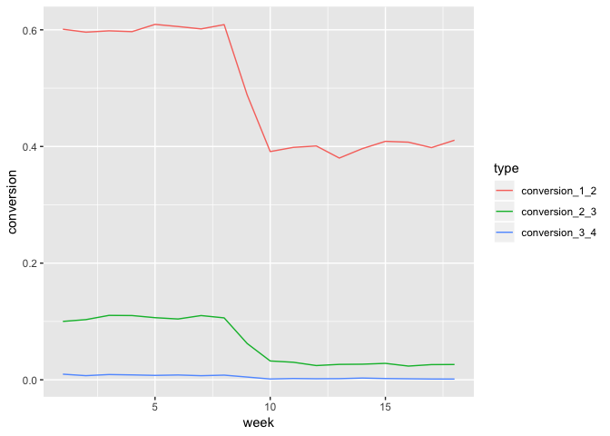
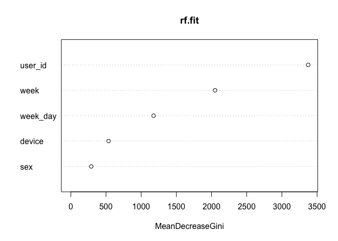
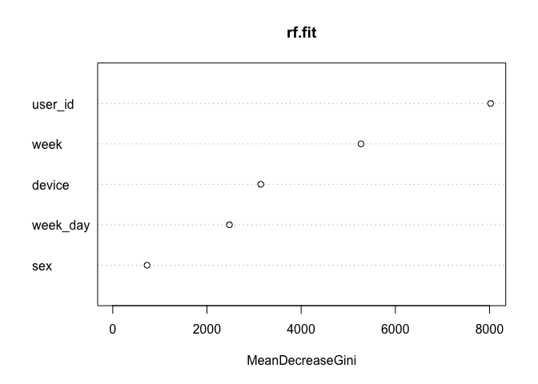
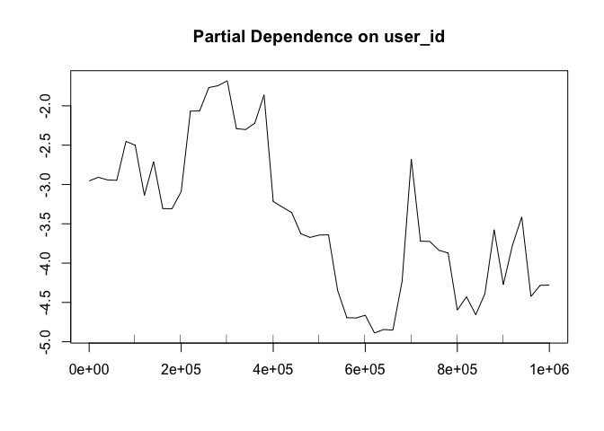
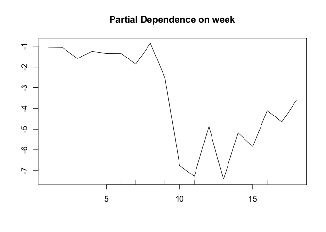
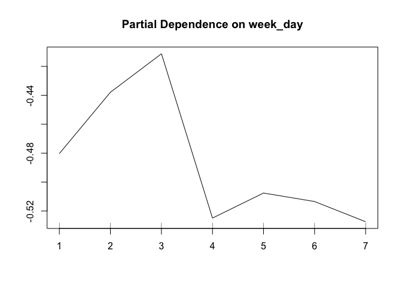
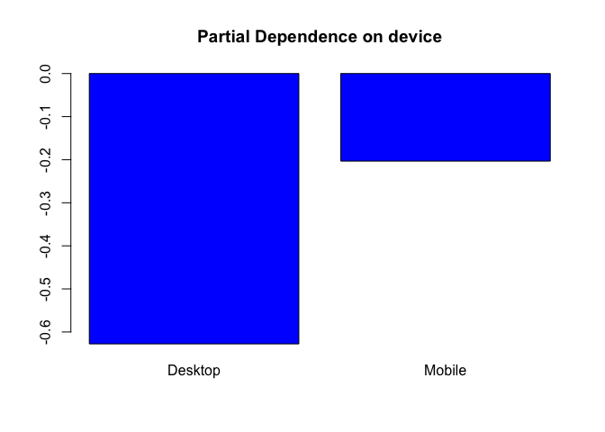
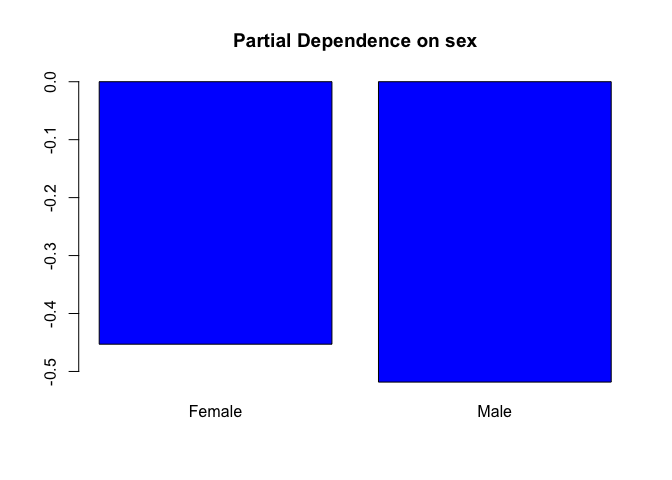

Funnel Analysis
================
Siddhartha Jetti
6/2/2019

# Goal

The goal is to perform funnel analysis for an e-commerce website.

Typically, websites have a clear path to conversion: for instance, you
land on the home page, then you search, select a product and buy it. At
each of these steps, some users will drop off and leave the site. The
sequence of pages that leads to conversion is called ‘funnel’ .

Data Science can have a tremendous impact on funnel optimization. Funnel
analysis allows to understand where/when our users abandon the website.
It gives crucial insights on user behavior and on ways to improve the
user experience as well as it often allows to discover bugs.

# Challenge Description

You are looking at data from an e-commerce website. The site is very
simple and has just 4 pages.

The first page is the home page. When you come to the site for the first
time, you can only land on the home page as a first page.

From the home page, the user can perform a search and land on the search
page.

From the search page, if the user clicks on a product, she will get to
the payment page, where she is asked to provide payment information in
order to buy that product.

If she does decide to buy, she ends up on the confirmation page.

The company CEO isn’t very happy with the company sales and, especially,
sales coming from new users. Therefore, she asked you to investigate
whether there is something wrong in the conversion funnel or, in
general, if you can create hypotheses on how conversion rate could be
improved.

Specifically, she is interested in :

1)  A full picture of funnel conversion rate for both desktop and mobile

2)  Some insights on what the product team should focus on in order to
    improve conversion rate as well as any anything you might discover
    that could help improve conversion rate.

# Data

We have 5 tables downloadable by clicking on here. All the tables refer
to only the user first experience on the site. The 5 tables are:

user\_table - info about the user

Columns:

  - user\_id : the Id of the user. It is unique by user and can be
    joined to user id in all other tables
  - date : the date when the user firstly landed on the site
  - device : user device. Can be mobile or desktop
  - sex : male/female

home\_page\_table - Users who landed on the home page

Columns:

  - user\_id : the Id of the user. It is unique by user and can be
    joined to user id in all other tables
  - page : it is always home\_page.

search\_page\_table - Users who landed on the search\_page

Columns:

  - user\_id : the Id of the user. It is unique by user and can be
    joined to user id in all other tables
  - page : it is always search\_page

payment\_page\_table - Users who landed on the payment\_page

Columns:

  - user\_id : the Id of the user. It is unique by user and can be
    joined to user id in all other tables
  - page : it is always payment\_page

payment\_confirmation\_table - Users who landed on the
payment\_confirmation\_table. That is, these are the users who bought
the product.

Columns:

  - user\_id : the Id of the user. It is unique by user and can be
    joined to user id in all other tables
  - page : it is always payment\_confirmation\_page

# Problem Setup

``` r
# Load required libraries
library(tidyverse)
```

    ## Registered S3 methods overwritten by 'ggplot2':
    ##   method         from 
    ##   [.quosures     rlang
    ##   c.quosures     rlang
    ##   print.quosures rlang

    ## ── Attaching packages ──────────────────────────────────────────────────────────────────────────── tidyverse 1.2.1 ──

    ## ✔ ggplot2 3.1.1     ✔ purrr   0.3.2
    ## ✔ tibble  2.1.1     ✔ dplyr   0.8.1
    ## ✔ tidyr   0.8.3     ✔ stringr 1.4.0
    ## ✔ readr   1.3.1     ✔ forcats 0.4.0

    ## ── Conflicts ─────────────────────────────────────────────────────────────────────────────── tidyverse_conflicts() ──
    ## ✖ dplyr::filter() masks stats::filter()
    ## ✖ dplyr::lag()    masks stats::lag()

``` r
library(randomForest)
```

    ## randomForest 4.6-14

    ## Type rfNews() to see new features/changes/bug fixes.

    ## 
    ## Attaching package: 'randomForest'

    ## The following object is masked from 'package:dplyr':
    ## 
    ##     combine

    ## The following object is masked from 'package:ggplot2':
    ## 
    ##     margin

``` r
library(lubridate)
```

    ## 
    ## Attaching package: 'lubridate'

    ## The following object is masked from 'package:base':
    ## 
    ##     date

``` r
# Read all the .csv files in the directory
home_page <- read.csv("home_page_table.csv")
search_page <- read.csv("search_page_table.csv")
payment_page <- read.csv("payment_page_table.csv")
payment_confirm_page <- read.csv("payment_confirmation_table.csv")
users <- read.csv("user_table.csv")
```

# Question 1

Before Merging the different datasets, its important to check the
validity of data. One important check that could be done is if every
user who hit search previously hit home page, every user who hit payment
page should exist in previous pages and so on.

``` r
# Check if all users who hit search page previously visited home page
all(search_page$user_id %in% home_page$user_id)
```

    ## [1] TRUE

``` r
# Check if all users who hit payment page previously visited search and home pages
all(payment_page$user_id %in% search_page$user_id) & all(search_page$user_id %in% home_page$user_id)
```

    ## [1] TRUE

``` r
# Check if all users who hit payment confirmation page previously visited payment, search and home pages
all(payment_confirm_page$user_id %in% payment_page$user_id) & all(payment_page$user_id %in% search_page$user_id) & all(search_page$user_id %in% home_page$user_id)
```

    ## [1] TRUE

Clearly all the users are going through the website in a funnel pattern
with out any exceptions and data looks fine.

``` r
page_data <- home_page %>%
  left_join(search_page, by = "user_id") %>%
  rename(page1 = page.x, page2 = page.y) %>%
  left_join(payment_page, by = "user_id") %>%
  rename(page3 = page) %>%
  left_join(payment_confirm_page, by = "user_id") %>%
  rename(page4 = page) %>%
  left_join(users, by = "user_id") %>%
  mutate(week = week(date),
         week_day = wday(date, label = TRUE))
```

Run descriptive
    statistics

``` r
head(page_data)
```

    ##   user_id     page1       page2 page3 page4       date  device    sex week
    ## 1  313593 home_page        <NA>  <NA>  <NA> 2015-02-26 Desktop Female    9
    ## 2  468315 home_page        <NA>  <NA>  <NA> 2015-02-21 Desktop   Male    8
    ## 3  264005 home_page        <NA>  <NA>  <NA> 2015-03-25 Desktop Female   12
    ## 4  290784 home_page        <NA>  <NA>  <NA> 2015-03-14 Desktop   Male   11
    ## 5  639104 home_page search_page  <NA>  <NA> 2015-01-03 Desktop Female    1
    ## 6  262889 home_page        <NA>  <NA>  <NA> 2015-01-10  Mobile   Male    2
    ##   week_day
    ## 1      Thu
    ## 2      Sat
    ## 3      Wed
    ## 4      Sat
    ## 5      Sat
    ## 6      Sat

``` r
table(page_data$device)
```

    ## 
    ## Desktop  Mobile 
    ##   60200   30200

Almost two-thirds of traffic is coming from desktops and only one-third
is from mobile.

Overall conversion rates by page

``` r
non_conversion <- page_data %>% 
  select(contains("page")) %>% 
  mutate_all(is.na) %>% 
  colMeans() 

conversions <- 1 - non_conversion
names(conversions)  <- names(non_conversion)
conversions
```

    ##      page1      page2      page3      page4 
    ## 1.00000000 0.50000000 0.06670354 0.00500000

  - The overall conversion rates by page reveal that 50% of traffic
    coming to home page moved on to search page.
  - About 6.7% percent of home page traffic clicked on a product in
    search page and landed onto payment.
  - Only 0.5% of original traffic decided to buy and ended up on
    confirmation page.

<!-- end list -->

``` r
page_data %>%
  group_by(device) %>%
  summarize(conversion_1_2 = mean(!is.na(page2)), conversion_2_3 = mean(!is.na(page3)), 
            conversion_3_4 = mean(!is.na(page4)), conversion_0 = mean(!is.na(page1)))
```

    ## # A tibble: 2 x 5
    ##   device  conversion_1_2 conversion_2_3 conversion_3_4 conversion_0
    ##   <fct>            <dbl>          <dbl>          <dbl>        <dbl>
    ## 1 Desktop            0.5           0.05        0.00249            1
    ## 2 Mobile             0.5           0.1         0.01               1

The page wise conversion rates by device reveals that conversion from
search to payment page is happening at a much lower rate on desktop than
mobile. Also, conversion from payment page to confirmation on desktop is
much lower than on mobile.

# Conclusion

The huge gap in search to payment conversion between desktop and mobile
versions indicates that search is not working properly in desktop
version. The problem could be that search in desktop version is not
showing relevant results as good as mobile version and resulting in
higher percentage of users leaving the site before purchasing. Given
that two-thirds of traffic comes from desktop, fixing the search on
desktop version would present a great opportunity for the e-commerce
company.

# Question 2

``` r
page_data %>%
  group_by(sex) %>%
  summarize(conversion_1_2 = mean(!is.na(page2)), conversion_2_3 = mean(!is.na(page3)), 
            conversion_3_4 = mean(!is.na(page4)))
```

    ## # A tibble: 2 x 4
    ##   sex    conversion_1_2 conversion_2_3 conversion_3_4
    ##   <fct>           <dbl>          <dbl>          <dbl>
    ## 1 Female          0.503         0.0688        0.00535
    ## 2 Male            0.497         0.0646        0.00466

Although the conversion rate among females appears to be higher than
males but its not anything shocking.

``` r
page_data %>%
  group_by(week_day) %>%
  summarize(conversion_1_2 = mean(!is.na(page2)), conversion_2_3 = mean(!is.na(page3)), 
            conversion_3_4 = mean(!is.na(page4)))
```

    ## # A tibble: 7 x 4
    ##   week_day conversion_1_2 conversion_2_3 conversion_3_4
    ##   <ord>             <dbl>          <dbl>          <dbl>
    ## 1 Sun               0.500         0.0662        0.00480
    ## 2 Mon               0.500         0.0671        0.00594
    ## 3 Tue               0.492         0.0672        0.00543
    ## 4 Wed               0.494         0.0653        0.00421
    ## 5 Thu               0.500         0.0669        0.00491
    ## 6 Fri               0.502         0.0683        0.00424
    ## 7 Sat               0.511         0.0660        0.00547

The conversion rate on Mondays is higher than any other day of the week.

``` r
page_week_summary <- page_data %>%
  group_by(week) %>%
  summarize(conversion_1_2 = mean(!is.na(page2)), conversion_2_3 = mean(!is.na(page3)), 
            conversion_3_4 = mean(!is.na(page4))) 

# Visualize by breaking down different page conversions
page_week_summary %>%
  gather(key = type, value = conversion, -week) %>%
  
  ggplot(aes(x = week, y = conversion, group = type)) +
  geom_line(aes(color = type))
```

<!-- -->

# Model Building

Random forest would be a good choice for predicting conversion rate as
it is strong with outliers and works well with correlated, continuous
and discrete variables. Also, random forest is easier to optimize
parameters.Partial dependence plots can be used to capture insights from
the model.

A standard 66-30% split can be used to generate training and test
datasets. If training dataset is not large enough then cross validation
can be used to arrive at the optimum parameters

``` r
# The response variable needs to be changed into a factor
data <- page_data %>%
  mutate(converted = as.factor(ifelse(is.na(page4),0,1))) %>%
  select(user_id, device, sex, week_day, week, converted)

# Training and test set split
set.seed(2019)
train_sample = sample(nrow(data), size = round(nrow(data)*0.66))
train_data = data[train_sample,]
test_data = data[-train_sample,]

# Build Random forest model on the data with mostly default settings except for class weight and #trees
rf.fit <- randomForest(y=train_data$converted, x = train_data[, -c(6)], ytest = test_data$converted, xtest = test_data[, -c(6)],  ntree = 50, mtry = 2, keep.forest = TRUE)

rf.fit
```

    ## 
    ## Call:
    ##  randomForest(x = train_data[, -c(6)], y = train_data$converted,      xtest = test_data[, -c(6)], ytest = test_data$converted,      ntree = 50, mtry = 2, keep.forest = TRUE) 
    ##                Type of random forest: classification
    ##                      Number of trees: 50
    ## No. of variables tried at each split: 2
    ## 
    ##         OOB estimate of  error rate: 0.5%
    ## Confusion matrix:
    ##       0 1 class.error
    ## 0 59364 0           0
    ## 1   300 0           1
    ##                 Test set error rate: 0.49%
    ## Confusion matrix:
    ##       0 1 class.error
    ## 0 30584 0           0
    ## 1   152 0           1

The OOB and test error rates look good but the model is useless as it is
classifying everything as class ‘0’. This is happening because of hugely
unbalanced data.

Now the strategy is to increase the weight of the minority class to
force the model towards correctly predicting more class 1 events. The
increase in class1 accuracy comes at the expense of class 0 and goal is
to strike the balance between them.

``` r
class0_error <- c()
class1_error <- c()
overall_accuracy <- c()

for (i in 1:9){

  rf.fit <- randomForest(y=train_data$converted, x = train_data[, -c(6)], ytest = test_data$converted, xtest = test_data[, -c(6)], ntree = 150, classwt=c(i, 10-i), mtry = 2, keep.forest = TRUE)
  class0_error <- c(class0_error, rf.fit$test$confusion[1,3])
  class1_error <- c(class1_error, rf.fit$test$confusion[2,3])
  overall_accuracy <- c(overall_accuracy, (rf.fit$test$confusion[1,1]+rf.fit$test$confusion[2,2])/sum(rf.fit$test$confusion[,-3]))
}

errors_df <- data.frame(weights = paste0(1:9,"-",9:1), class0_error, class1_error, overall_accuracy)
errors_df
```

    ##   weights class0_error class1_error overall_accuracy
    ## 1     1-9  0.198796756    0.5197368        0.7996161
    ## 2     2-8  0.129021711    0.6776316        0.8682652
    ## 3     3-7  0.087431337    0.7434211        0.9093246
    ## 4     4-6  0.073404394    0.7697368        0.9231520
    ## 5     5-5  0.053361235    0.7894737        0.9429984
    ## 6     6-4  0.039497777    0.8552632        0.9564680
    ## 7     7-3  0.022920481    0.9078947        0.9727030
    ## 8     8-2  0.003858227    0.9671053        0.9913782
    ## 9     9-1  0.000000000    1.0000000        0.9950547

The above table shows that the optimium class wt ratio is around
6:4

``` r
rf.fit <- randomForest(y=train_data$converted, x = train_data[, -c(6)], ytest = test_data$converted, xtest = test_data[, -c(6)],  ntree = 150, classwt=c(6,4), mtry = 2, keep.forest = TRUE)
rf.fit
```

    ## 
    ## Call:
    ##  randomForest(x = train_data[, -c(6)], y = train_data$converted,      xtest = test_data[, -c(6)], ytest = test_data$converted,      ntree = 150, mtry = 2, classwt = c(6, 4), keep.forest = TRUE) 
    ##                Type of random forest: classification
    ##                      Number of trees: 150
    ## No. of variables tried at each split: 2
    ## 
    ##         OOB estimate of  error rate: 5%
    ## Confusion matrix:
    ##       0    1 class.error
    ## 0 56641 2723  0.04586955
    ## 1   262   38  0.87333333
    ##                 Test set error rate: 4.6%
    ## Confusion matrix:
    ##       0    1 class.error
    ## 0 29297 1287  0.04208083
    ## 1   126   26  0.82894737

``` r
# Visualize Important variables
varImpPlot(rf.fit)
```

<!-- -->

Now, lets try to build model without
user\_id

``` r
rf.fit2 <- randomForest(y=train_data$converted, x = train_data[, -c(1,6)], ytest = test_data$converted, xtest = test_data[, -c(1,6)],  ntree = 150, classwt=c(6,4), mtry = 2, keep.forest = TRUE)
rf.fit2
```

    ## 
    ## Call:
    ##  randomForest(x = train_data[, -c(1, 6)], y = train_data$converted,      xtest = test_data[, -c(1, 6)], ytest = test_data$converted,      ntree = 150, mtry = 2, classwt = c(6, 4), keep.forest = TRUE) 
    ##                Type of random forest: classification
    ##                      Number of trees: 150
    ## No. of variables tried at each split: 2
    ## 
    ##         OOB estimate of  error rate: 16.86%
    ## Confusion matrix:
    ##       0    1 class.error
    ## 0 49450 9914   0.1670036
    ## 1   144  156   0.4800000
    ##                 Test set error rate: 16.98%
    ## Confusion matrix:
    ##       0    1 class.error
    ## 0 25440 5144   0.1681925
    ## 1    74   78   0.4868421

There is a clear drop in overall test set accuracy by dropping user\_id.
The optimum model should infact be rf.fit.

``` r
# Visualize Important variables
varImpPlot(rf.fit)
```

<!-- -->

``` r
# Order variables by importance
imp_vars <- importance(rf.fit)
pdp_vars <- names(sort(imp_vars[,1], decreasing = T))
```

After tweaking the class weights, the model is not predicting all events
as majority class. The improvement in class1 error was accomplished
without hurting class0 and overall accuracy too much. The variables user
id, lat and long are dominating other variables. Now, lets try to
rebuild the model without including those variables and visualize the
variable
importance

# PDP Analysis

``` r
# Loop through variables and build PDP in the decreasing order of variable importance
for (i in seq_along(pdp_vars)) {
  partialPlot(rf.fit, data[,-6], pdp_vars[i], xlab="",
              main=paste("Partial Dependence on", pdp_vars[i]), which.class=1)
}
```

<!-- --><!-- --><!-- --><!-- --><!-- -->

# Conclusion

  - The Partial Dependence plots reveal that the conversion rate is
    relatively higher during the first 8 weeks (January and February) of
    year and goes down over the next 4 weeks and then picks up in the
    later weeks. Its possible that there could be some seasonality in
    the user buying patterns.

  - The PD plots and descriptive charts reveal that desktop version of
    the site is very much underperforming compared to mobile version.
    More precisely the search in desktop version which is causing
    greater proportion of users to leave without purchasing. One
    possible reason could be bad UI/experience or presence of bugs that
    are turning off users from converting in desktop version. The
    product team should immediately focus on identifying these issue
    with desktop version.

  - Another possible reason for higher number of users and lower
    conversion on desktop version is that the mobile app didn’t somehow
    become popular, so you just have very engaged users using mobile and
    they obviously convert at a higher rate. There are very low number
    of casual mobile visitors. Also it’s possible that the site is
    spending a lot of money on ads on desktop. And these ads are
    attracting the wrong kind of people.

  - Tuesday appears to be slightly better than other days and
    introducing promotions could improve the overall conversion rate for
    the site.

  - The PD plots also reveal that after controlling for device and other
    important variables, males appear to be performing better than
    females and naturally marketing should focus on increasing the
    relative weight of this segment.
