Loan granting
================
Siddhartha Jetti
6/6/2019

# Goal

Another area where data science and machine learning play a huge role is
in choosing if granting a loan. This is a particularly hot field as many
start-ups feel that bank loan models can be improved. Therefore, there
is space to come up with better loaning strategies that can benefit both
the lender and the borrower.

In this challenge, you will have access to loan data from a bank and
will have to improve their model.

# Challenge Description

We have access to a specific bank loan data. We have data about all
loans asked to the bank, whether the bank decided to grant it and,
finally, whether the borrower managed to repay it. We also have info
about the person asking for the loan at the moment she is asking for the
loan.

You have to come up with a better strategy to grant loans. Specifically
you should:

Build a model which is better than the bank model. Assume that: If you
grant the loan and the it doesn’t get repaid, you lose 1. If you grant
the loan and the it does get repaid, you gain 1 If you don’t grant the
loan, you gain 0.

Using the rules above, compare bank profitability vs your model
profitability.

  - Describe the impact of the most important variables on the
    prediction. Also, focus on the variable “is\_employed”, which
    describes whether the borrower is employed when she asks for the
    loan. How does this variable impact the model? Explain why.

  - Are there any other variables you’d like to include in the model?

# Data

We have 2 table downloadable by clicking here.

The 2 tables are:

loan\_table - general information about the loan

### Columns:

  - loan\_id : the id of the loan. Unique by loan. Can be joined to loan
    id in the other table
  - loan\_purpose : the reason for asking the loan: investment, other,
    business, emergency\_funds, home
  - date : when the loan was asked
  - loan\_granted : whether the loan was granted
  - loan\_repaid : whether the loan was repaid. NA means that the loan
    was not granted

borrower\_table - information about the borrower

### Columns:

  - loan\_id : the id of the the loan. Unique by loan. Can be joined to
    loan id in the other table
  - is\_first\_loan : did she ask for any other loans in her lifetime?
  - fully\_repaid\_previous\_loans : did she pay on time all of her
    previous loans? If this is the first loan, it is NA
  - currently\_repaying\_other\_loans : is she currently repaying any
    other loans? If this is the first loan, it is NA
  - total\_credit\_card\_limit : total credit card monthly limit
  - avg\_percentage\_credit\_card\_limit\_used\_last\_year : on an
    average, how much did she use of her credit card limit in the
    previous 12 months. This number can be \>1 since it is possible to
    go above the credit card limit
  - saving\_amount : total saving amount balance when she asked for the
    loan
  - checking\_amount : total checking amount balance when she asked for
    the loan
  - is\_employed : whether she is employed (1) or not (0)
  - yearly\_salary : how much she earned in the previous year
  - age : her age
  - dependent\_number : number of people she claims as dependent

# Problem Setup

``` r
# Load required libraries
library(dplyr)
```

    ## 
    ## Attaching package: 'dplyr'

    ## The following objects are masked from 'package:stats':
    ## 
    ##     filter, lag

    ## The following objects are masked from 'package:base':
    ## 
    ##     intersect, setdiff, setequal, union

``` r
library(ggplot2)
```

    ## Registered S3 methods overwritten by 'ggplot2':
    ##   method         from 
    ##   [.quosures     rlang
    ##   c.quosures     rlang
    ##   print.quosures rlang

``` r
library(randomForest)
```

    ## randomForest 4.6-14

    ## Type rfNews() to see new features/changes/bug fixes.

    ## 
    ## Attaching package: 'randomForest'

    ## The following object is masked from 'package:ggplot2':
    ## 
    ##     margin

    ## The following object is masked from 'package:dplyr':
    ## 
    ##     combine

``` r
library(ROCR)
```

    ## Loading required package: gplots

    ## 
    ## Attaching package: 'gplots'

    ## The following object is masked from 'package:stats':
    ## 
    ##     lowess

``` r
# Read in the input data into a dataframe
borrower <- read.csv("borrower_table.csv")
loan <- read.csv("loan_table.csv")
```

# Question 1:

Understanding and transforming the
data

``` r
# Joining both loan and borrower tables. Transform variables to right format
data <- loan %>%
  inner_join(borrower, by = "loan_id") 

# Take a peak at the data
str(data)
```

    ## 'data.frame':    101100 obs. of  16 variables:
    ##  $ loan_id                                        : int  19454 496811 929493 580653 172419 77085 780070 303138 91475 422392 ...
    ##  $ loan_purpose                                   : Factor w/ 5 levels "business","emergency_funds",..: 4 4 5 5 1 5 1 2 4 1 ...
    ##  $ date                                           : Factor w/ 260 levels "2012-01-02","2012-01-03",..: 54 12 29 128 101 175 53 175 105 214 ...
    ##  $ loan_granted                                   : int  0 0 0 1 1 0 1 1 1 0 ...
    ##  $ loan_repaid                                    : int  NA NA NA 1 0 NA 1 0 1 NA ...
    ##  $ is_first_loan                                  : int  1 1 1 0 1 1 0 0 0 0 ...
    ##  $ fully_repaid_previous_loans                    : int  NA NA NA 1 NA NA 1 0 1 1 ...
    ##  $ currently_repaying_other_loans                 : int  NA NA NA 0 NA NA 0 1 0 1 ...
    ##  $ total_credit_card_limit                        : int  8600 5300 0 5400 2900 3000 7800 4300 3900 1000 ...
    ##  $ avg_percentage_credit_card_limit_used_last_year: num  0.79 0.52 NA 0.52 0.76 0.82 0.3 1.02 0.65 1.09 ...
    ##  $ saving_amount                                  : int  1491 141 660 3345 1050 1028 4206 886 1837 134 ...
    ##  $ checking_amount                                : int  6285 5793 3232 2764 3695 3269 4368 1597 3795 1408 ...
    ##  $ is_employed                                    : int  1 0 1 1 1 0 1 1 1 0 ...
    ##  $ yearly_salary                                  : int  45200 0 26500 15800 34800 0 51100 15000 12000 0 ...
    ##  $ age                                            : int  42 42 60 58 31 45 51 59 24 36 ...
    ##  $ dependent_number                               : int  7 5 4 4 4 3 2 2 1 2 ...

``` r
summary(data)
```

    ##     loan_id                loan_purpose           date      
    ##  Min.   :    30   business       :21707   2012-03-27:  500  
    ##  1st Qu.:250334   emergency_funds:18091   2012-12-25:  488  
    ##  Median :499885   home           :24314   2012-07-31:  487  
    ##  Mean   :499667   investment     :21484   2012-03-06:  478  
    ##  3rd Qu.:749706   other          :15504   2012-01-31:  477  
    ##  Max.   :999987                           2012-07-03:  477  
    ##                                           (Other)   :98193  
    ##   loan_granted     loan_repaid    is_first_loan   
    ##  Min.   :0.0000   Min.   :0.00    Min.   :0.0000  
    ##  1st Qu.:0.0000   1st Qu.:0.00    1st Qu.:0.0000  
    ##  Median :0.0000   Median :1.00    Median :1.0000  
    ##  Mean   :0.4714   Mean   :0.64    Mean   :0.5435  
    ##  3rd Qu.:1.0000   3rd Qu.:1.00    3rd Qu.:1.0000  
    ##  Max.   :1.0000   Max.   :1.00    Max.   :1.0000  
    ##                   NA's   :53446                   
    ##  fully_repaid_previous_loans currently_repaying_other_loans
    ##  Min.   :0.0                 Min.   :0.00                  
    ##  1st Qu.:1.0                 1st Qu.:0.00                  
    ##  Median :1.0                 Median :0.00                  
    ##  Mean   :0.9                 Mean   :0.36                  
    ##  3rd Qu.:1.0                 3rd Qu.:1.00                  
    ##  Max.   :1.0                 Max.   :1.00                  
    ##  NA's   :54947               NA's   :54947                 
    ##  total_credit_card_limit avg_percentage_credit_card_limit_used_last_year
    ##  Min.   :    0           Min.   :0.000                                  
    ##  1st Qu.: 2700           1st Qu.:0.600                                  
    ##  Median : 4100           Median :0.730                                  
    ##  Mean   : 4113           Mean   :0.724                                  
    ##  3rd Qu.: 5500           3rd Qu.:0.860                                  
    ##  Max.   :13500           Max.   :1.090                                  
    ##                          NA's   :6972                                   
    ##  saving_amount   checking_amount  is_employed     yearly_salary  
    ##  Min.   :    0   Min.   :    0   Min.   :0.0000   Min.   :    0  
    ##  1st Qu.:  834   1st Qu.: 1706   1st Qu.:0.0000   1st Qu.:    0  
    ##  Median : 1339   Median : 2673   Median :1.0000   Median :21500  
    ##  Mean   : 1800   Mean   : 3177   Mean   :0.6587   Mean   :21021  
    ##  3rd Qu.: 2409   3rd Qu.: 4241   3rd Qu.:1.0000   3rd Qu.:35300  
    ##  Max.   :10641   Max.   :13906   Max.   :1.0000   Max.   :97200  
    ##                                                                  
    ##       age        dependent_number
    ##  Min.   :18.00   Min.   :0.000   
    ##  1st Qu.:32.00   1st Qu.:2.000   
    ##  Median :41.00   Median :3.000   
    ##  Mean   :41.49   Mean   :3.865   
    ##  3rd Qu.:50.00   3rd Qu.:6.000   
    ##  Max.   :79.00   Max.   :8.000   
    ## 

Check for missing values in the data.

``` r
# count of missing values by column in the merged data
colSums(is.na(data))
```

    ##                                         loan_id 
    ##                                               0 
    ##                                    loan_purpose 
    ##                                               0 
    ##                                            date 
    ##                                               0 
    ##                                    loan_granted 
    ##                                               0 
    ##                                     loan_repaid 
    ##                                           53446 
    ##                                   is_first_loan 
    ##                                               0 
    ##                     fully_repaid_previous_loans 
    ##                                           54947 
    ##                  currently_repaying_other_loans 
    ##                                           54947 
    ##                         total_credit_card_limit 
    ##                                               0 
    ## avg_percentage_credit_card_limit_used_last_year 
    ##                                            6972 
    ##                                   saving_amount 
    ##                                               0 
    ##                                 checking_amount 
    ##                                               0 
    ##                                     is_employed 
    ##                                               0 
    ##                                   yearly_salary 
    ##                                               0 
    ##                                             age 
    ##                                               0 
    ##                                dependent_number 
    ##                                               0

``` r
# is there a pattern in missing values?
data %>%
  filter(is.na(loan_repaid)) %>%
  select(loan_granted) %>%
  distinct()
```

    ##   loan_granted
    ## 1            0

``` r
data %>%
  filter(is.na(fully_repaid_previous_loans) | is.na(currently_repaying_other_loans)) %>%
  select(is_first_loan) %>%
  distinct()
```

    ##   is_first_loan
    ## 1             1

``` r
data %>%
  filter(is.na(avg_percentage_credit_card_limit_used_last_year)) %>%
  select(total_credit_card_limit) %>%
  distinct()
```

    ##   total_credit_card_limit
    ## 1                       0

Clearly, There is a pattern in missing values and are not occuring at
random.

Missing values exist in ‘fully\_repaid\_previous\_loans’ and
‘currently\_repaying\_other\_loans’ variables only for the customers
who are applying for the first loan. The variable ‘loan\_repaid’ is
missing only for customers who are not granted a loan. Also,
‘avg\_percentage\_credit\_card\_limit\_used\_last\_year’ is missing
only for customers whose credit limit is zero. All this makes sense.

Imputation for missing values is required.

``` r
data %>%
  select(loan_repaid, fully_repaid_previous_loans, currently_repaying_other_loans, avg_percentage_credit_card_limit_used_last_year) %>%
  head()
```

    ##   loan_repaid fully_repaid_previous_loans currently_repaying_other_loans
    ## 1          NA                          NA                             NA
    ## 2          NA                          NA                             NA
    ## 3          NA                          NA                             NA
    ## 4           1                           1                              0
    ## 5           0                          NA                             NA
    ## 6          NA                          NA                             NA
    ##   avg_percentage_credit_card_limit_used_last_year
    ## 1                                            0.79
    ## 2                                            0.52
    ## 3                                              NA
    ## 4                                            0.52
    ## 5                                            0.76
    ## 6                                            0.82

Three of the above variables are discrete and one is continuous. Due to
the non-random nature of missing values, new category should be created
for missing values in categorical variables and a very high number is
imputed for missing values in continuous variables.

``` r
data <- data %>%
  mutate(fully_repaid_previous_loans = as.factor(ifelse(is.na(fully_repaid_previous_loans), -1, fully_repaid_previous_loans)),
         currently_repaying_other_loans = as.factor(ifelse(is.na(currently_repaying_other_loans), -1, currently_repaying_other_loans)),
         avg_percentage_credit_card_limit_used_last_year = ifelse(is.na(avg_percentage_credit_card_limit_used_last_year), 9999, avg_percentage_credit_card_limit_used_last_year),
         is_employed = as.factor(is_employed),
         is_first_loan = as.factor(is_first_loan))
```

Estimating the bank profitability based on existing lending policy.

``` r
data %>%
    transmute(profitability = ifelse(loan_granted == 0, 0, loan_repaid*(loan_granted + 1) - 1)) %>%
    summarize(profit = sum(as.numeric(profitability)))
```

    ##   profit
    ## 1  13758

The bank profit based on the gain/loss rules is 13758.

``` r
summary(data)
```

    ##     loan_id                loan_purpose           date      
    ##  Min.   :    30   business       :21707   2012-03-27:  500  
    ##  1st Qu.:250334   emergency_funds:18091   2012-12-25:  488  
    ##  Median :499885   home           :24314   2012-07-31:  487  
    ##  Mean   :499667   investment     :21484   2012-03-06:  478  
    ##  3rd Qu.:749706   other          :15504   2012-01-31:  477  
    ##  Max.   :999987                           2012-07-03:  477  
    ##                                           (Other)   :98193  
    ##   loan_granted     loan_repaid    is_first_loan
    ##  Min.   :0.0000   Min.   :0.00    0:46153      
    ##  1st Qu.:0.0000   1st Qu.:0.00    1:54947      
    ##  Median :0.0000   Median :1.00                 
    ##  Mean   :0.4714   Mean   :0.64                 
    ##  3rd Qu.:1.0000   3rd Qu.:1.00                 
    ##  Max.   :1.0000   Max.   :1.00                 
    ##                   NA's   :53446                
    ##  fully_repaid_previous_loans currently_repaying_other_loans
    ##  -1:54947                    -1:54947                      
    ##  0 : 4648                    0 :29338                      
    ##  1 :41505                    1 :16815                      
    ##                                                            
    ##                                                            
    ##                                                            
    ##                                                            
    ##  total_credit_card_limit avg_percentage_credit_card_limit_used_last_year
    ##  Min.   :    0           Min.   :   0.00                                
    ##  1st Qu.: 2700           1st Qu.:   0.61                                
    ##  Median : 4100           Median :   0.75                                
    ##  Mean   : 4113           Mean   : 690.22                                
    ##  3rd Qu.: 5500           3rd Qu.:   0.90                                
    ##  Max.   :13500           Max.   :9999.00                                
    ##                                                                         
    ##  saving_amount   checking_amount is_employed yearly_salary  
    ##  Min.   :    0   Min.   :    0   0:34508     Min.   :    0  
    ##  1st Qu.:  834   1st Qu.: 1706   1:66592     1st Qu.:    0  
    ##  Median : 1339   Median : 2673               Median :21500  
    ##  Mean   : 1800   Mean   : 3177               Mean   :21021  
    ##  3rd Qu.: 2409   3rd Qu.: 4241               3rd Qu.:35300  
    ##  Max.   :10641   Max.   :13906               Max.   :97200  
    ##                                                             
    ##       age        dependent_number
    ##  Min.   :18.00   Min.   :0.000   
    ##  1st Qu.:32.00   1st Qu.:2.000   
    ##  Median :41.00   Median :3.000   
    ##  Mean   :41.49   Mean   :3.865   
    ##  3rd Qu.:50.00   3rd Qu.:6.000   
    ##  Max.   :79.00   Max.   :8.000   
    ## 

After Imputation, no missing values exist in the dataset other than
loan\_repaid variable.

Run descriptive stats on the input data. Clearly, variables if employed,
saving\_amount and salary appear to matter to determine the probability
of repayment of the loan.

Check if\_employed vs loan\_repaid

``` r
is_employed_data <- data %>%
  filter(loan_granted == 1) %>%
  mutate(loan_repaid = as.factor(loan_repaid)) %>%
  group_by(is_employed,loan_repaid) %>%
  summarize(counts = n())

ggplot(data = is_employed_data, aes(x = is_employed, y = counts, fill = loan_repaid))+
  geom_bar(stat = "identity")
```

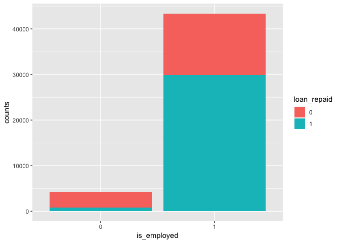<!-- -->

Clearly, Among the loans taken by employed majority of them are repaid,
which makes sense. Check how salary effects loan repaid variable.

``` r
employed_data <- data %>%
  group_by(loan_repaid) %>%
  summarise(mean_yearly_salary = mean(yearly_salary),
            mean_savings = mean(saving_amount))


ggplot(data = employed_data, aes(x = loan_repaid, y = mean_yearly_salary))+
       geom_bar(stat = "identity")
```

    ## Warning: Removed 1 rows containing missing values (position_stack).

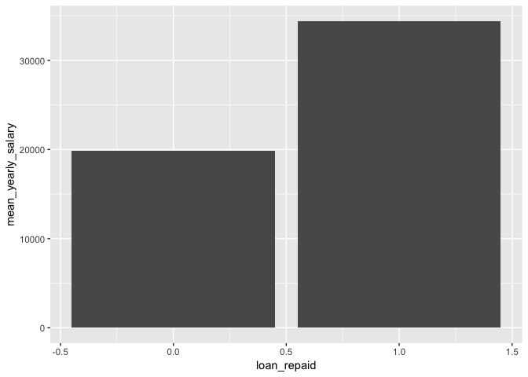<!-- -->

``` r
ggplot(data = employed_data, aes(x = loan_repaid, y = mean_savings))+
       geom_bar(stat = "identity")
```

    ## Warning: Removed 1 rows containing missing values (position_stack).

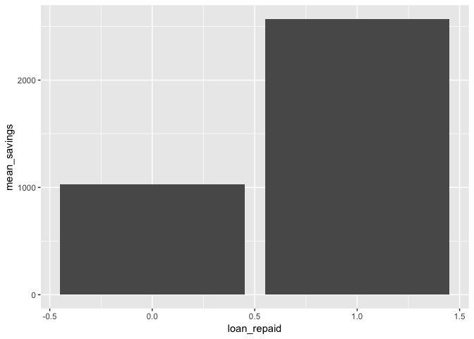<!-- -->

The above plots reveal that loans that are repaid, reported on an
average higher savings balance and higher yearly salary than the loans
that are not repaid.

# Model Building

The gain or loss rules are as follows \* If loan is granted and does not
get repaid, loss 1. \* If loan is granted and gets repaid, gain 1. \* If
loan is not granted, gain 0.

Lets build a model to estimate probability of repayment of loan and
eventually predict if loan gets repaid or not. Random forest would be a
good candidate as it is strong with outliers and works well with
correlated, continuous and discrete variables. Also, random forest is
easier to optimize parameters.Partial dependence plots can be used to
capture insights from the model.

Define the class 0 as loan not getting repaid and class 1 as loan
getting repaid. The goal is to build random forest model and find
optimal cuttoff probability that maximizes profit based on the above
rules. The loan will be granted only if estimated probability of
repayment is more than chosen cuttoff else the loan gets denied.

  - False positive, FP results in -1
  - True positive, TP results in +1
  - False negative, FN results in 0
  - True negative, TN results in 0

The model should be built using only the rows where loans are granted as
we know if loan is eventually repaid or not. The rows where loan not
granted are excluded from the training sample. A standard 66-33% split
can be used to generate training and test datasets. If training dataset
is not large enough then cross validation can be used to arrive at the
optimum parameters

``` r
# save loans that are denied by bank for future use
loans_denied <- data %>%
  filter(loan_granted == 0)

# Training and test set split
data <- data %>%
  filter(loan_granted == 1) %>%
  select(-loan_id, -date, -loan_granted) %>%
  mutate(loan_repaid = as.factor(loan_repaid))

set.seed(2019)
train_sample = sample(nrow(data), size = round(nrow(data)*0.66))
train_data = data[train_sample,]
test_data = data[-train_sample,]

# Build Random forest model on the data with mostly default settings except for class weight and #trees
rf.fit <- randomForest(y = train_data$loan_repaid, x = train_data[,-c(2)], ytest = test_data$loan_repaid, 
                       xtest = test_data[,-c(2)],  ntree = 250, mtry = 4, keep.forest = TRUE)

rf.fit
```

    ## 
    ## Call:
    ##  randomForest(x = train_data[, -c(2)], y = train_data$loan_repaid,      xtest = test_data[, -c(2)], ytest = test_data$loan_repaid,      ntree = 250, mtry = 4, keep.forest = TRUE) 
    ##                Type of random forest: classification
    ##                      Number of trees: 250
    ## No. of variables tried at each split: 4
    ## 
    ##         OOB estimate of  error rate: 7.89%
    ## Confusion matrix:
    ##       0     1 class.error
    ## 0 10225  1011  0.08997864
    ## 1  1470 18746  0.07271468
    ##                 Test set error rate: 8.1%
    ## Confusion matrix:
    ##      0    1 class.error
    ## 0 5160  552  0.09663866
    ## 1  760 9730  0.07244995

``` r
# Visualize Important variables
varImpPlot(rf.fit)
```

<!-- -->

From the variable importance plot, Variables ‘saving\_amount’ and
‘checking\_amount’ have too much importance compared with other
variables. This is happening because those variables are acting as a
proxy for other variables and have in them part of the information from
other variables. Lets rebuild the model by removing these to see how it
changes the variable
importance.

``` r
# Build Random forest model on the data with mostly default settings except for class weight and #trees
# without the top variables
rf.fit2 <- randomForest(y = train_data$loan_repaid, x = train_data[,-c(2,8,9)], ytest = test_data$loan_repaid, 
                       xtest = test_data[,-c(2,8,9)],  ntree = 250, keep.forest = TRUE)

rf.fit2
```

    ## 
    ## Call:
    ##  randomForest(x = train_data[, -c(2, 8, 9)], y = train_data$loan_repaid,      xtest = test_data[, -c(2, 8, 9)], ytest = test_data$loan_repaid,      ntree = 250, keep.forest = TRUE) 
    ##                Type of random forest: classification
    ##                      Number of trees: 250
    ## No. of variables tried at each split: 3
    ## 
    ##         OOB estimate of  error rate: 19.2%
    ## Confusion matrix:
    ##      0     1 class.error
    ## 0 7610  3626   0.3227127
    ## 1 2412 17804   0.1193114
    ##                 Test set error rate: 18.66%
    ## Confusion matrix:
    ##      0    1 class.error
    ## 0 3887 1825   0.3195028
    ## 1 1198 9292   0.1142040

``` r
# Visualize Important variables
varImpPlot(rf.fit2)
```

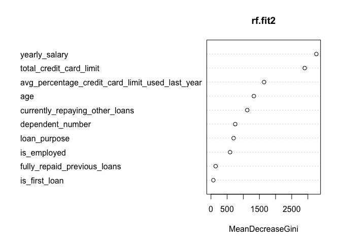<!-- -->

Overall error rate, class 0 error rate and class 1 error rate look
decent. The model can be used for insights. Also, training and test
error are close indicating that model is not overfitting to data.

``` r
# Order variables by importance
imp_vars <- importance(rf.fit)
pdp_vars <- names(sort(imp_vars[,1], decreasing = T))

# Loop through variables and build PDP in the decreasing order of variable importance
for (i in seq_along(pdp_vars)) {
  partialPlot(rf.fit, data[,-2], pdp_vars[i], xlab="",
              main=paste("Partial Dependence on", pdp_vars[i]), which.class=1)
}
```

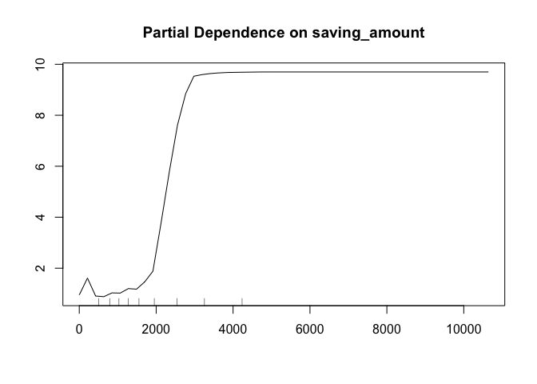<!-- -->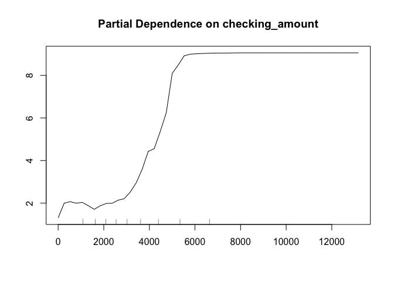<!-- -->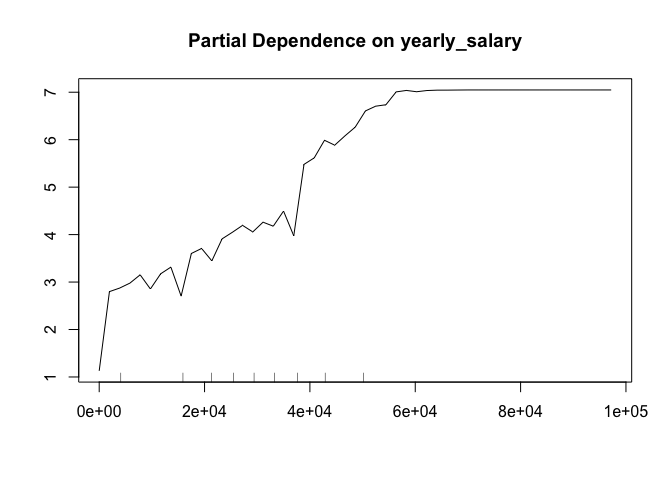<!-- -->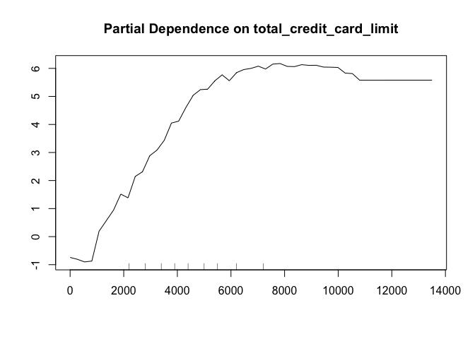<!-- -->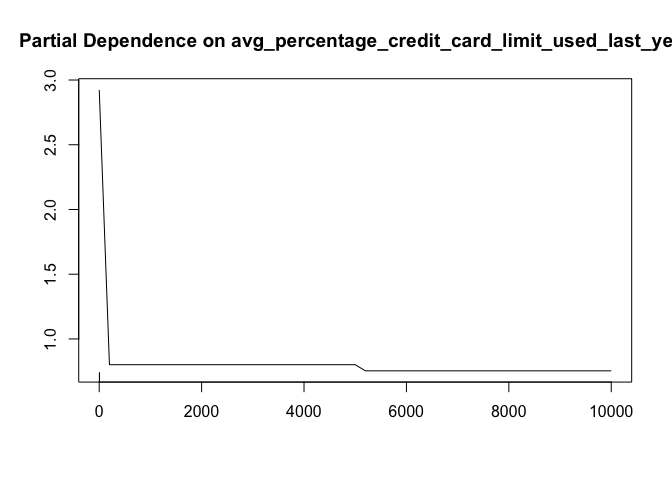<!-- -->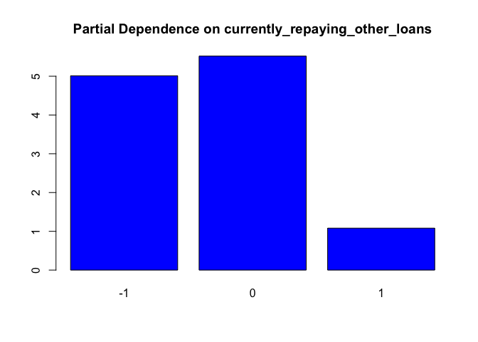<!-- -->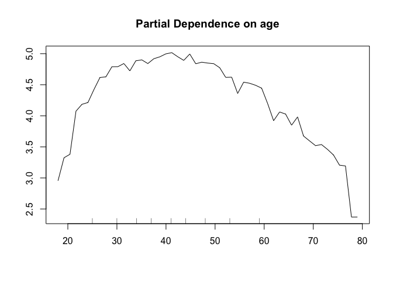<!-- -->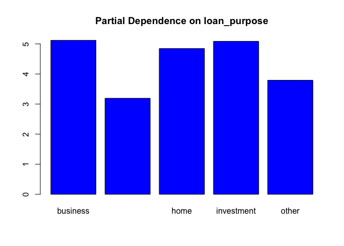<!-- -->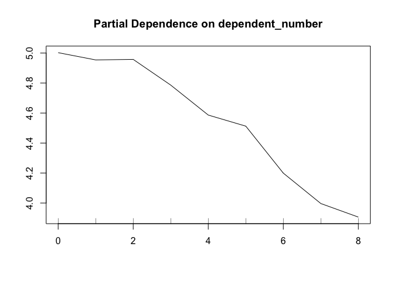<!-- -->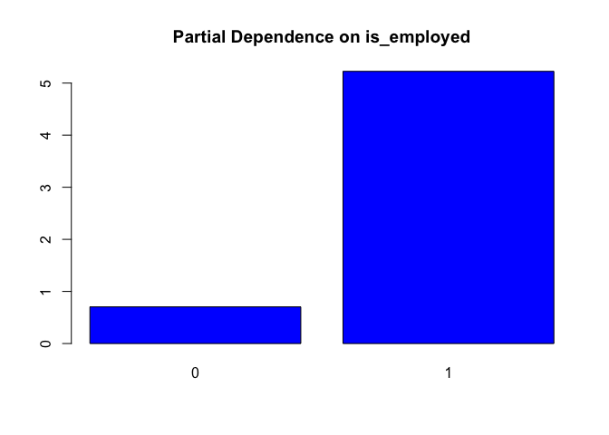<!-- -->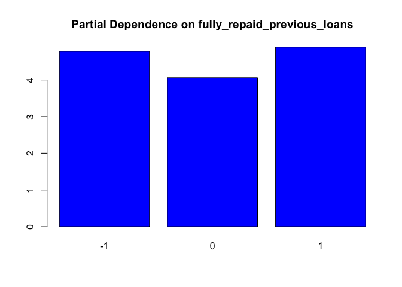<!-- -->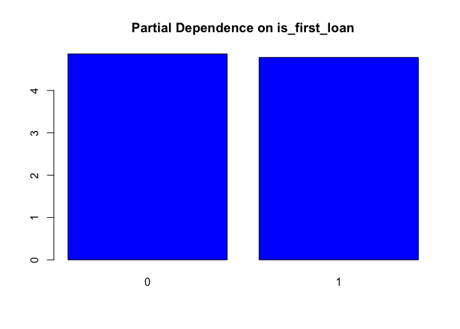<!-- -->

# Question 2

Now finding the cuttoff probability that maximizes the profit.

``` r
#Compare predictions (votes) vs actual results for the test set
pred = prediction(rf.fit$test$votes[,2], test_data$loan_repaid)

error_cutoff = data.frame (pred@cutoffs,
                           pred@tn,
                           pred@fn,
                           pred@fp,
                           pred@tp, 
                           row.names = NULL)
colnames(error_cutoff) = c("cutoff", "tn", "fn", "fp", "tp")

error_cutoff <- error_cutoff %>%
  mutate(profit = tp-fp) %>%
  arrange(desc(profit))

error_cutoff[1,]
```

    ##   cutoff   tn  fn  fp   tp profit
    ## 1   0.52 5202 798 510 9692   9182

The cuttoff probability of 0.52 results in maximum profit based on the
gain/loss rules. Now use the model “rf.fit” and the above cuttoff to
score the all the loans where bank originally granted loans and compare
the profit with bank’s profit.

``` r
repayment_prob <- predict(rf.fit, data[,-2], type = "prob")
loan_status <- ifelse(repayment_prob[,2] > 0.52, 'Grant', 'Deny')

# Number of loans granted or denied
table(loan_status)
```

    ## loan_status
    ##  Deny Grant 
    ## 17252 30402

``` r
# Among the granted ones, how many would be repaid or not repaid
repay_status <- data$loan_repaid[which(loan_status == 'Grant')]
status <- table(repay_status)

# Profit with new model
status[2] - status[1]
```

    ##     1 
    ## 29396

Among the 47654 loans granted by bank, the new model would only grant
30402 loans and deny 17252 loans. Out of the granted 30402 loans, 29899
would be repaid and 503 would not be repaid. This results in a total
gain of 29396 much higher than bank’s profit of 13758.

The new model reveals that to get maximum profit, the bank should grant
loans only if the repayment probability predicted by it is more than
52%.

Now use the new model to score the loans that were denied by the
bank.

``` r
loans_denied_repayment <- predict(rf.fit, loans_denied[,-c(1,3,4,5)], type = "prob")
loan_status <- ifelse(loans_denied_repayment[,2] > 0.52, 'Grant', 'Deny')

table(loan_status)
```

    ## loan_status
    ##  Deny Grant 
    ## 34874 18572

The fact that bank denied these loans should indicate that they are bad
loans with low probability of repayment. Not suprisingly, new model
would deny 65% of these loans and grant only 35% of them.

# Question 3

The following conclusions can be drawn from the variable importance plot
and Partial dependence plots of the full model “rf.fit”.

  - The variables savings amount and checking amount appear to dominate
    other variables in terms of variable importance. It is likely that
    these variables are correlated and acting as a proxy for other
    variables and have in them part of the information from other
    variables as well.

  - The variable “is\_employed” which appeared to be an important
    variable in descriptive stats appears to have very low importance in
    the combined model. This is counter intuitive because people who are
    employed have steady cash flow and are expected to have higher
    chance of repayment. This can be explained from the fact that
    is\_employed is highly correlated with savings/checking amount and
    perfectly correlated with yearly salary. Also, banks offer higher
    credit limits for employed people. Generally people who are employed
    tend to have higher saving/checking balance,yearly salary and credit
    limit than people who are not. After controlling for the
    saving/checking amount, yearly salary and credit limit variables,
    there is not much information left to be extracted from is\_employed
    and its importance appears low. The following plots provide evidence
    in favor of the above hypothesis.

<!-- end list -->

``` r
employed_data <- data %>%
  group_by(is_employed) %>%
  summarise(mean_yearly_salary = mean(yearly_salary),
            mean_savings = mean(saving_amount),
            mean_checking = mean(checking_amount),
            mean_credit_limit = mean(total_credit_card_limit))
employed_data
```

    ## # A tibble: 2 x 5
    ##   is_employed mean_yearly_sala… mean_savings mean_checking mean_credit_lim…
    ##   <fct>                   <dbl>        <dbl>         <dbl>            <dbl>
    ## 1 0                          0         1317.         2464.            3545.
    ## 2 1                      32144.        2092.         3602.            4625.

``` r
# Relation between is_employed and yearly salary
ggplot(data = employed_data, aes(x = is_employed, y = mean_yearly_salary))+
       geom_bar(stat = "identity")
```

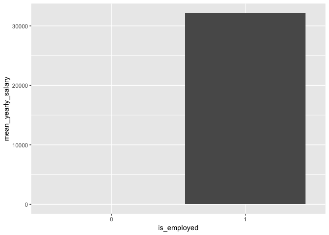<!-- -->

``` r
# Relation between is_employed and mean savings amount
ggplot(data = employed_data, aes(x = is_employed, y = mean_savings))+
       geom_bar(stat = "identity")
```

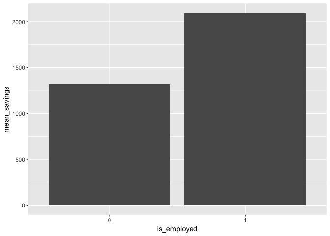<!-- -->

``` r
# Relation between is_employed and mean checking
ggplot(data = employed_data, aes(x = is_employed, y = mean_checking))+
       geom_bar(stat = "identity")
```

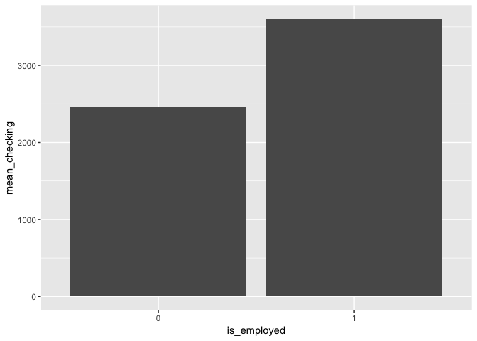<!-- -->

``` r
# Relation between is_employed and mean credit limit
ggplot(data = employed_data, aes(x = is_employed, y = mean_credit_limit))+
       geom_bar(stat = "identity")
```

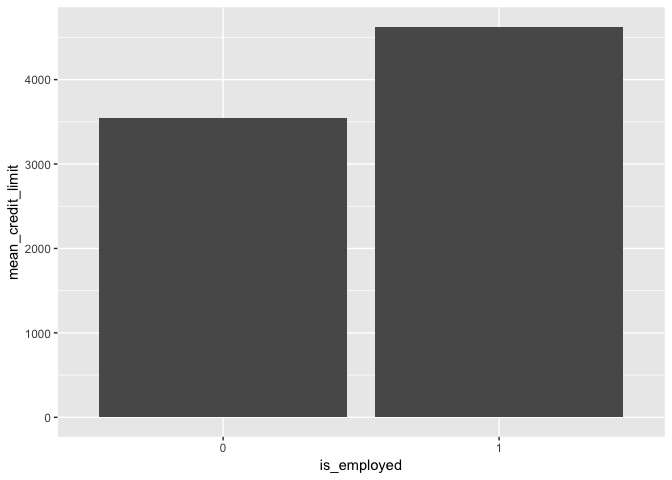<!-- -->

  - People with higher saving/checking amount, higher credit limit and
    higher salary perform better in terms of loan repayment.

  - People who are currently repaying other loans appear to have lower
    chance of repayment than people who are not currently repaying as
    they have higher financial burden.

  - The chance of repayment appear to be highest in middle aged people
    roughly around 40 yrs and appears to drop after.

  - Loans for emergency funds appear to be less likely to be repaid than
    loans taken for business or investment purpose.

  - People with more number of dependents are less likely to repay than
    people with fewer dependents.

  - People who repaid loans fully in the past appear to have higher
    chances of repaying the loans again.

  - After controlling for all the other variables, is first loan
    variable does not appear to matter much.

# Question 4

Suprisingly, the data provided for this exercise lacks a critical
variable like loan amount (amount they are seeking through the loan). If
loan amount is very high then it could make even a credit worthy person
to look bad and get denied on the loan. I would include this variable in
the model.

Another variable that is not provided is the total existing debt (all
kinds) each person has. This variable is important because higher debt
would cause higher financial burden which could affect the chance of
repayment.
