Online Video Challenge
================
Siddhartha Jetti
7/4/2019

# Goal

The company of this challenge allows users to upload videos online, just
like YouTube.

This company is interested in knowing whether a video is “hot”
(i.e. trending up in terms of popularity), stable or going down.
Understanding this would allow to optimize the videos promoted on the
home-page and, therefore, maximize ads revenue.

# Challenge Description

Company XYZ is an online video streaming company, just like YouTube or
Dailymotion.

The Head of Product has identified as a major problem for the site a
very high home page drop-off rate. That is, users come to the home-page
and then leave the site without taking any action or watching any video.
Since customer acquisition costs are very high, this is a huge problem:
the company is spending a lot of money to acquire users who don’t
generate any revenue by clicking on ads.

Currently, the videos shown on the home page to new users are manually
chosen. The Head of Product had this idea of creating a new recommended
video section on the home page.

He asked you the following:

1)  Classify each video into one these 3 categories: ”Hot” - means
    trending up. These videos are candidate to be shown. “Stable and
    Popular” - video view counts are flat, but very high. These videos
    are candidates to be shown too. “Everything else” - these videos
    won’t be shown. What are the main characteristics of the “hot
    videos”?

2)  After having identified the characteristics of the hot videos, how
    would you use this information from a product standpoint?

# Data

We have 2 tables downloadable by clicking here.

The 2 tables are:

video\_count - provides information about how many times each video was
seen each day.

## Columns:

  - video\_id : video id, unique by video and joinable to the video id
    in the other table
  - count : total count of views for each video
  - date : on which day that video was watched that many times

video\_features - characteristics of the video.

## Columns:

  - video\_id : video id, unique by video and joinable to the video id
    in the other table
  - video\_length : length of the video in seconds
  - video\_language : language of the video, as selected by the user
    when she uploaded the video
  - video\_upload\_date : when the video was uploaded
  - video\_quality : quality of the video. It can be \[ 240p, 360p,
    480p, 720p, 1080p\]

# Problem Setup

``` r
# Load required libraries
library(dplyr)
```

    ## 
    ## Attaching package: 'dplyr'

    ## The following objects are masked from 'package:stats':
    ## 
    ##     filter, lag

    ## The following objects are masked from 'package:base':
    ## 
    ##     intersect, setdiff, setequal, union

``` r
library(ggplot2)
```

    ## Registered S3 methods overwritten by 'ggplot2':
    ##   method         from 
    ##   [.quosures     rlang
    ##   c.quosures     rlang
    ##   print.quosures rlang

``` r
library(lubridate)
```

    ## 
    ## Attaching package: 'lubridate'

    ## The following object is masked from 'package:base':
    ## 
    ##     date

``` r
library(randomForest)
```

    ## randomForest 4.6-14

    ## Type rfNews() to see new features/changes/bug fixes.

    ## 
    ## Attaching package: 'randomForest'

    ## The following object is masked from 'package:ggplot2':
    ## 
    ##     margin

    ## The following object is masked from 'package:dplyr':
    ## 
    ##     combine

``` r
# Read in the input data into a dataframe
views <- read.csv("video_count.csv", stringsAsFactors = F) 
features <- read.csv("video_features.csv", stringsAsFactors = F) 
```

# Question 1:

Explore the views dataset

``` r
# Transform views dataset
views <- views %>%
  mutate(date = as.Date(date)) %>%
  arrange(video_id, date)

# Check data types of each of the columns
summary(views)
```

    ##     video_id        count              date           
    ##  Min.   :   1   Min.   :      1   Min.   :2015-01-01  
    ##  1st Qu.: 754   1st Qu.:   9096   1st Qu.:2015-01-04  
    ##  Median :1492   Median : 179558   Median :2015-01-08  
    ##  Mean   :1499   Mean   : 624371   Mean   :2015-01-08  
    ##  3rd Qu.:2236   3rd Qu.: 904362   3rd Qu.:2015-01-12  
    ##  Max.   :3000   Max.   :6070570   Max.   :2015-01-15

``` r
# Take a peek at data
head(views)
```

    ##   video_id  count       date
    ## 1        1 140460 2015-01-01
    ## 2        1 129082 2015-01-02
    ## 3        1 120868 2015-01-03
    ## 4        1  97849 2015-01-04
    ## 5        1  94821 2015-01-05
    ## 6        1  76196 2015-01-06

Explore the features dataset

``` r
# Transform features dataset
features <- features %>%
  mutate(video_upload_date = as.Date(video_upload_date)) %>%
  arrange(video_id)

# Check data types of each of the columns
summary(features)
```

    ##     video_id     video_length    video_language     video_upload_date   
    ##  Min.   :   1   Min.   :   9.0   Length:2785        Min.   :2014-12-02  
    ##  1st Qu.: 754   1st Qu.: 363.0   Class :character   1st Qu.:2014-12-09  
    ##  Median :1492   Median : 631.0   Mode  :character   Median :2014-12-12  
    ##  Mean   :1499   Mean   : 684.8                      Mean   :2014-12-12  
    ##  3rd Qu.:2236   3rd Qu.: 973.0                      3rd Qu.:2014-12-16  
    ##  Max.   :3000   Max.   :2114.0                      Max.   :2014-12-24  
    ##  video_quality     
    ##  Length:2785       
    ##  Class :character  
    ##  Mode  :character  
    ##                    
    ##                    
    ## 

``` r
# Take a peek at data
head(features)
```

    ##   video_id video_length video_language video_upload_date video_quality
    ## 1        1         1496             Es        2014-12-04          720p
    ## 2        2          751             Cn        2014-12-14          480p
    ## 3        3          807             En        2014-12-15         1080p
    ## 4        4          545             En        2014-12-11          360p
    ## 5        5          953             En        2014-12-10         1080p
    ## 6        6          652             En        2014-12-08          720p

Check for missing values in the views and features data.

``` r
# count of missing values by column in views dataset
colSums(is.na(views))
```

    ## video_id    count     date 
    ##        0        0        0

``` r
# count of missing values by column in features dataset
colSums(is.na(features))
```

    ##          video_id      video_length    video_language video_upload_date 
    ##                 0                 0                 0                 0 
    ##     video_quality 
    ##                 0

No missing values exist anywhere in the data.

Check if count data exists for all the videos for all the dates.

``` r
table(views$date)
```

    ## 
    ## 2015-01-01 2015-01-02 2015-01-03 2015-01-04 2015-01-05 2015-01-06 
    ##       2785       2785       2785       2785       2785       2785 
    ## 2015-01-07 2015-01-08 2015-01-09 2015-01-10 2015-01-11 2015-01-12 
    ##       2785       2785       2785       2785       2785       2785 
    ## 2015-01-13 2015-01-14 2015-01-15 
    ##       2785       2785       2785

Clearly, The video counts are provided for 15 days starting from January
1st 2015.

``` r
length(unique(views$video_id))
```

    ## [1] 2785

There are 2785 videos and 15 days of view counts data exist for every
video.

Here the goal is to classify videos into Hot, stable and others based on
if videos are trending up or down. Extracting trend from the time series
of views count is essential to accomplish this task.

There are several ways to extract the trend. The simplest method is to
fit a straight line that is closest to the views count data points for
each video, In other words finding the line that minimizes the total sum
of squared distances between the points and line.

Let’s pick few arbitrary videos and visualize the time series of views.

``` r
views %>%
  filter(video_id == 176) %>%

ggplot(aes(date, count)) +
  geom_point() +
  geom_smooth(method = "lm", se = FALSE)
```

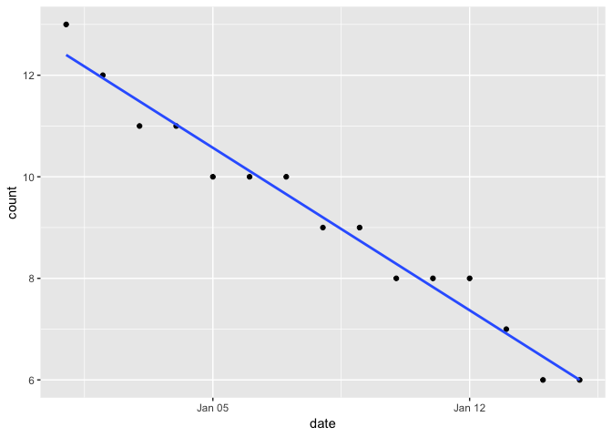<!-- -->

``` r
views %>%
  filter(video_id == 499) %>%

ggplot(aes(date, count)) +
  geom_point() +
  geom_smooth(method = "lm", se = FALSE)
```

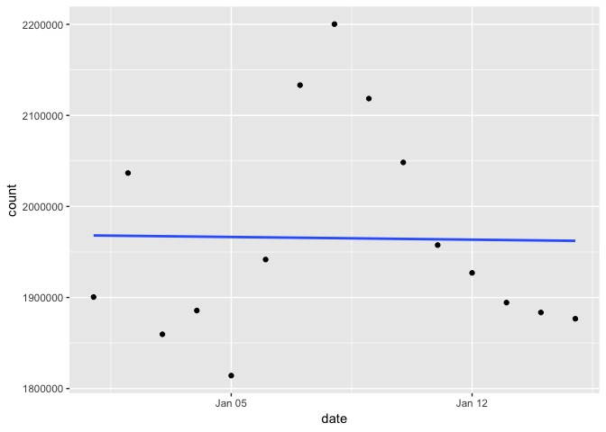<!-- -->

For the selected video “176”, the least sum of squares line appears to
be a good fit to the data. But for video “499”, it looks like a poor
fit. Since the goal here is not to predict future counts but only for a
descriptive purpose, the linear trend line approach can still be used.
The slope of trendline is the coefficient of date variable in regression
line equation. The positive slope indicates that views are trending up
and a negative slope indicates the video is trending down in terms of
views over time,

Before finding the least sum of squares fit to all the videos, let us
normalize the variables so that visualizing the trendlines of various
videos becomes easy.

``` r
# Function to normalize the variables
normalize <- function(x) {
    return((x - min(x)) / (max(x) - min(x)))
}

# Function to extract slope and trend in the data
slope_trendline <- function(y, x) {
  trendline <- lm(formula = y ~ x)
  return(trendline$coefficients[2])
}

# Now group by video id, normalize variables and extract slope
views_summary <- views %>%
  mutate(date = as.numeric(date),
         count_norm = normalize(count),
         date_norm = normalize(date)) %>%
  group_by(video_id) %>%
  summarise(avg_views_per_day = round(mean(count), digits = 0),
            slope = slope_trendline(count_norm, date_norm))

# Take a look at the data
head(views_summary)
```

    ## # A tibble: 6 x 3
    ##   video_id avg_views_per_day   slope
    ##      <int>             <dbl>   <dbl>
    ## 1        1             70636 -0.0199
    ## 2        2           1737141 -0.0262
    ## 3        3           2292781  0.0710
    ## 4        4           2740392  0.0709
    ## 5        5            447997 -0.116 
    ## 6        6             73148 -0.0256

Here is the distribution of average counts per
    day

``` r
quantile(views_summary$avg_views_per_day, probs = seq(0, 1, by = 0.05)) 
```

    ##        0%        5%       10%       15%       20%       25%       30% 
    ##       5.0      95.4     183.0     327.0    7253.6   19498.0   43921.2 
    ##       35%       40%       45%       50%       55%       60%       65% 
    ##   75940.2  113051.4  164110.2  219769.0  289480.6  371858.0  486236.4 
    ##       70%       75%       80%       85%       90%       95%      100% 
    ##  640775.2  843663.0 1168728.2 1655790.6 2107397.8 2610152.2 4211932.0

``` r
views_summary %>%
  ggplot() +
  geom_histogram(bins = 30, aes(x = avg_views_per_day, y = ..density..)) +
  geom_density(aes(x = avg_views_per_day, y = ..density..))
```

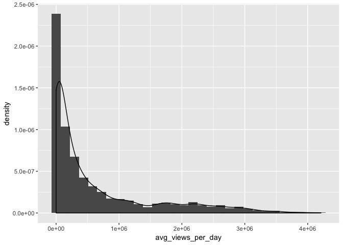<!-- -->

The distribution of slopes of
    trendlines

``` r
quantile(views_summary$slope, probs = seq(0, 1, by = 0.1)) 
```

    ##            0%           10%           20%           30%           40% 
    ## -4.317951e-01 -1.391199e-01 -7.838781e-02 -4.505069e-02 -2.089760e-02 
    ##           50%           60%           70%           80%           90% 
    ## -3.067727e-03 -1.100391e-06  1.215672e-03  1.258889e-02  4.939126e-02 
    ##          100% 
    ##  7.292824e-01

``` r
views_summary %>%
  ggplot() +
  geom_histogram(bins = 30, aes(x = slope)) 
```

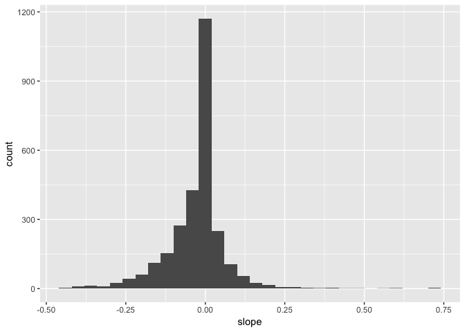<!-- -->

Based on the above distributions, Here are the rules that can be thought
of to classify videos into Hot, stable and others.

  - If slope \>= 0.02 then video is “Hot”
  - If -0.02 \< slope \< 0.02 and average views per day more than
    1,000,000 then video is “Stable and Popular”.
  - If none of the above then video is “Everything else”"

<!-- end list -->

``` r
# Classifying videos based on the stated rules
views_summary <- views_summary %>%
  mutate(category = case_when(
                      slope >= 0.02 ~ "Hot",
                      slope > -0.02 & slope < 0.02 & avg_views_per_day > 1000000 ~ "Stable and Popular",
                      TRUE ~ "Everything else")
  )

# Frequency of different video categories
table(views_summary$category)
```

    ## 
    ##    Everything else                Hot Stable and Popular 
    ##               2183                486                116

# Question 2:

Now, The goal is to build a model to predict if a video is “Hot” and
understand the factors that effect it.

Run descriptive stats on the video features dataset

``` r
# Merging the two datasets
data <- features %>%
  left_join(views_summary, by = "video_id") %>%
  mutate(is_hot = as.factor(ifelse(category == "Hot", 1, 0)),
         days_after_upload = as.Date("2015-01-15") - video_upload_date,
         video_language = as.factor(video_language),
         video_quality = as.factor(video_quality),
         upload_weekday = as.factor(weekdays(video_upload_date)),
         upload_week = week(video_upload_date)) %>%
  select(-video_upload_date, -category, -slope)

# Variable data types
summary(data)
```

    ##     video_id     video_length    video_language video_quality
    ##  Min.   :   1   Min.   :   9.0   Cn   :838      1080p:796    
    ##  1st Qu.: 754   1st Qu.: 363.0   De   : 69      240p :262    
    ##  Median :1492   Median : 631.0   En   :836      360p :423    
    ##  Mean   :1499   Mean   : 684.8   Es   :358      480p :635    
    ##  3rd Qu.:2236   3rd Qu.: 973.0   Fr   : 78      720p :669    
    ##  Max.   :3000   Max.   :2114.0   Other:606                   
    ##                                                              
    ##  avg_views_per_day is_hot   days_after_upload   upload_weekday
    ##  Min.   :      5   0:2299   Length:2785       Friday   :300   
    ##  1st Qu.:  19498   1: 486   Class :difftime   Monday   :315   
    ##  Median : 219769            Mode  :numeric    Saturday :252   
    ##  Mean   : 624371                              Sunday   :295   
    ##  3rd Qu.: 843663                              Thursday :509   
    ##  Max.   :4211932                              Tuesday  :537   
    ##                                               Wednesday:577   
    ##   upload_week  
    ##  Min.   :48.0  
    ##  1st Qu.:49.0  
    ##  Median :50.0  
    ##  Mean   :49.9  
    ##  3rd Qu.:50.0  
    ##  Max.   :52.0  
    ## 

``` r
data %>%
  group_by(is_hot) %>%
  summarise(avg_length = mean(video_length)) %>%
ggplot() +
  geom_col(aes(x = is_hot, y = avg_length))
```

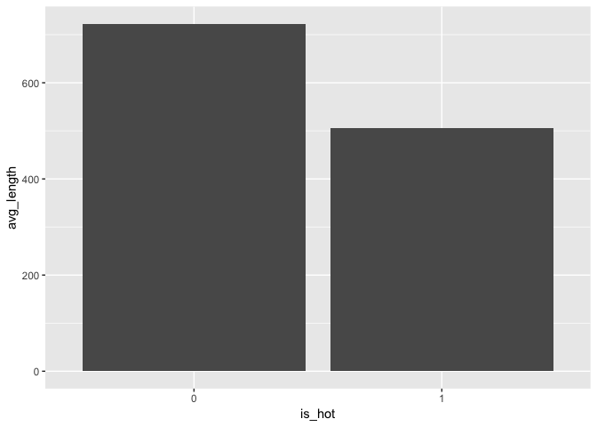<!-- -->

``` r
ggplot(data, aes(x = video_length, group = is_hot)) +
  geom_histogram(binwidth = 120, aes(fill = is_hot))
```

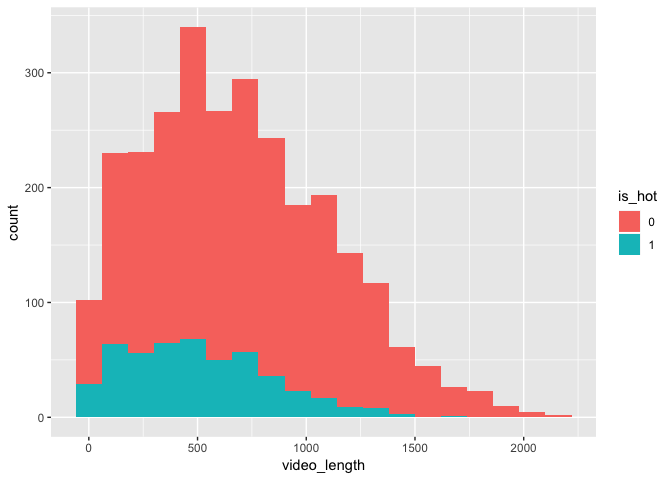<!-- -->

The average length of Hot videos is much lower than other videos. The
histogram of video length reveals that proportion of Hot videos is much
lower in the long videos than shorter ones.

Average views per day by language

``` r
data %>%
  group_by(video_language) %>%
  summarise(avg_views_per_day_per_video = mean(avg_views_per_day)) %>%
ggplot() +
  geom_col(aes(x = video_language, y = avg_views_per_day_per_video))
```

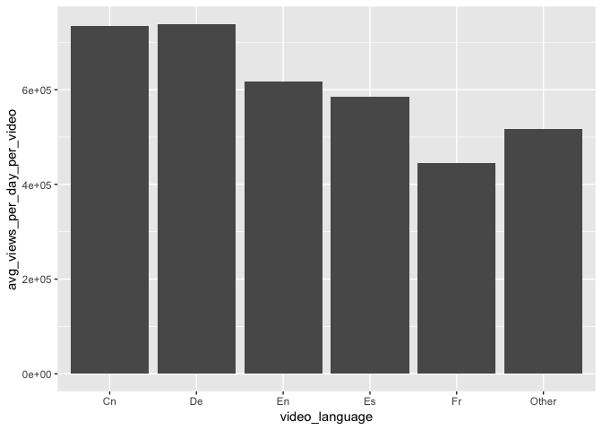<!-- -->

Number of videos uploaded and proportion of hot videos by language

``` r
data %>%
  group_by(video_language, is_hot) %>%
  summarise(counts = n()) %>%
  mutate(freq = round(counts / sum(counts), digits = 2)) %>%
ggplot(aes(x = video_language, y = counts, group = is_hot)) +
       geom_col(aes(fill = is_hot)) +
       geom_text(aes(label = paste0(freq*100, "%")))
```

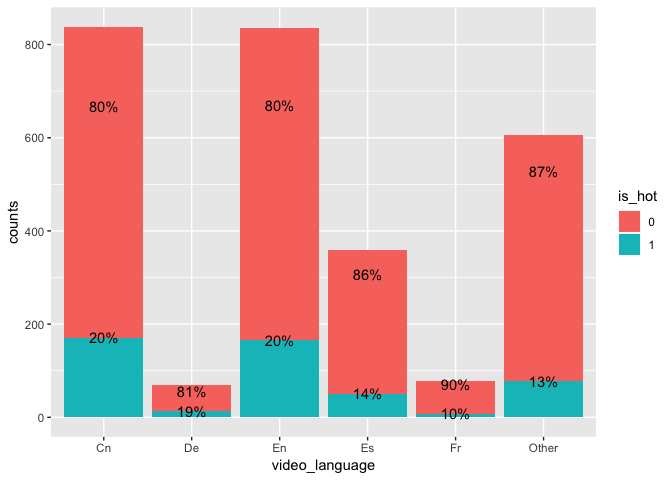<!-- -->

The bar chart reveals that German and French videos are much less in
number than other languages. The highest number of videos exist in
English and Chinese than other languages.

Number of videos uploaded and proportion of hot videos by quality

``` r
data %>%
  group_by(video_quality, is_hot) %>%
  summarise(counts = n()) %>%
  mutate(freq = round(counts / sum(counts), digits = 2)) %>%
ggplot(aes(x = video_quality, y = counts, group = is_hot)) +
       geom_col(aes(fill = is_hot)) +
       geom_text(aes(label = paste0(freq*100, "%")))
```

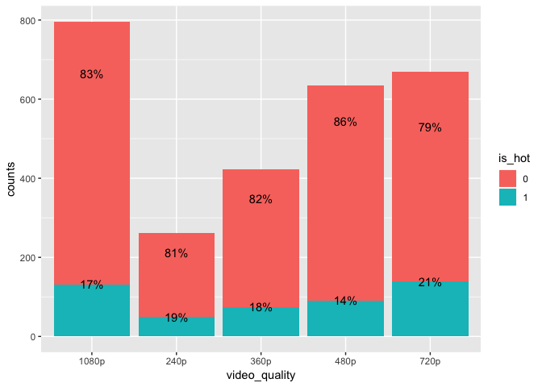<!-- -->

Number of videos uploaded and proportion of hot videos by upload week
day

``` r
data %>%
  group_by(upload_weekday, is_hot) %>%
  summarise(counts = n()) %>%
  mutate(freq = round(counts / sum(counts), digits = 2)) %>%
ggplot(aes(x = upload_weekday, y = counts, group = is_hot)) +
       geom_col(aes(fill = is_hot)) +
       geom_text(aes(label = paste0(freq*100, "%")))
```

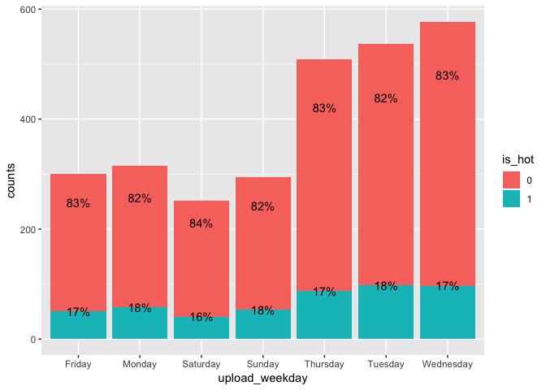<!-- -->

## Model Building:

Random forest would be a good choice for predicting “Hot” videos as it
is strong with outliers and works well with correlated, continuous and
discrete variables. Also, random forest is easier to optimize
parameters. Partial dependence plots can be used to capture insights
from the model.

A standard 66-30% split can be used to generate training and test
datasets. If training dataset is not large enough then cross validation
can be used to arrive at the optimum parameters

``` r
# Split the available data into training and test data sets 
set.seed(2019)
train_sample = sample(nrow(data), size = round(nrow(data)*0.66))
train_data = data[train_sample,]
test_data = data[-train_sample,]

# Build Random forest model on the data with mostly default settings except for class weight and #trees
rf.fit <- randomForest(y = train_data$is_hot, x = train_data[, -c(5,6)], ytest = test_data$is_hot, 
                       xtest = test_data[, -c(5,6)],  ntree = 250, mtry = 3, keep.forest = TRUE)

rf.fit
```

    ## 
    ## Call:
    ##  randomForest(x = train_data[, -c(5, 6)], y = train_data$is_hot,      xtest = test_data[, -c(5, 6)], ytest = test_data$is_hot,      ntree = 250, mtry = 3, keep.forest = TRUE) 
    ##                Type of random forest: classification
    ##                      Number of trees: 250
    ## No. of variables tried at each split: 3
    ## 
    ##         OOB estimate of  error rate: 17.85%
    ## Confusion matrix:
    ##      0  1 class.error
    ## 0 1491 51  0.03307393
    ## 1  277 19  0.93581081
    ##                 Test set error rate: 20.49%
    ## Confusion matrix:
    ##     0  1 class.error
    ## 0 734 23  0.03038309
    ## 1 171 19  0.90000000

``` r
# Visualize Important variables
varImpPlot(rf.fit)
```

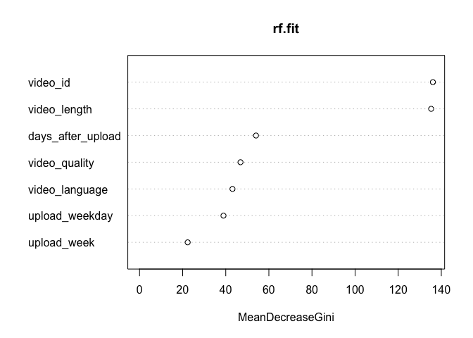<!-- -->

``` r
# Order variables by importance
imp_vars <- importance(rf.fit)
pdp_vars <- names(sort(imp_vars[,1], decreasing = T))

# Loop through variables and build PDP in the decreasing order of variable importance
for (i in seq_along(pdp_vars)) {
  partialPlot(rf.fit, data[,-c(5,6)], pdp_vars[i], xlab = "", 
              main = paste("Partial Dependence on", pdp_vars[i]), which.class = 1)
}
```

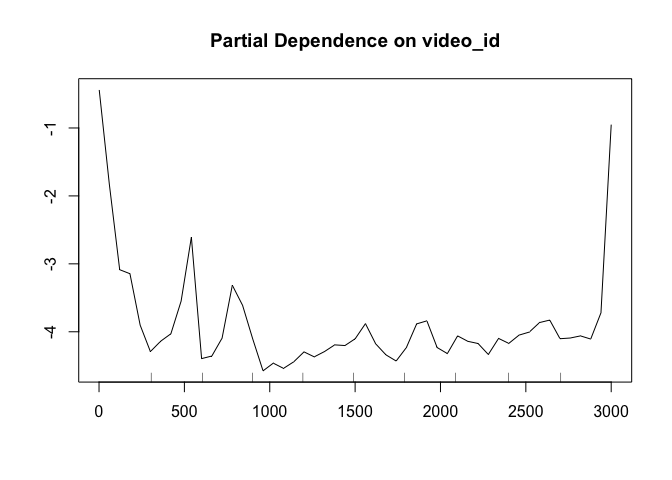<!-- -->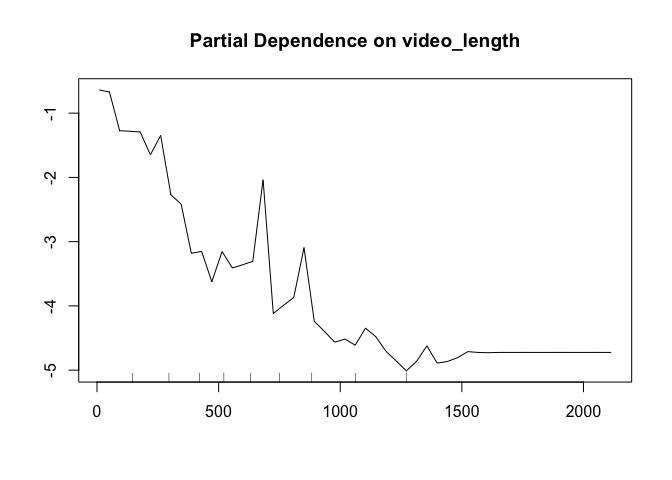<!-- --><!-- -->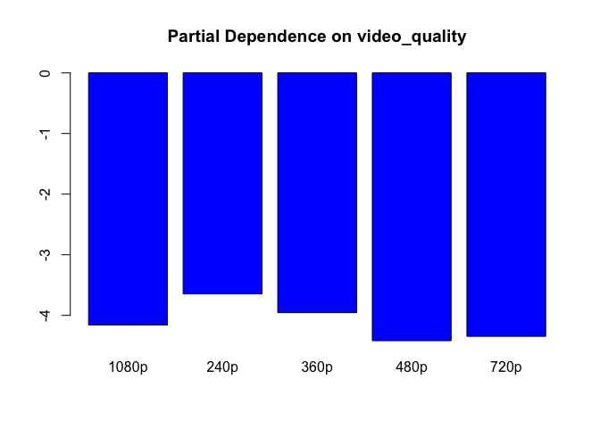<!-- -->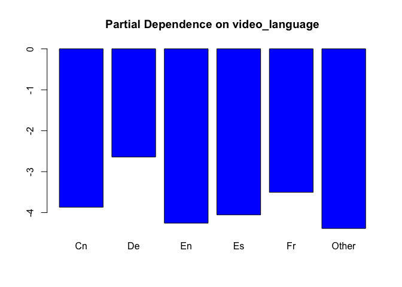<!-- --><!-- -->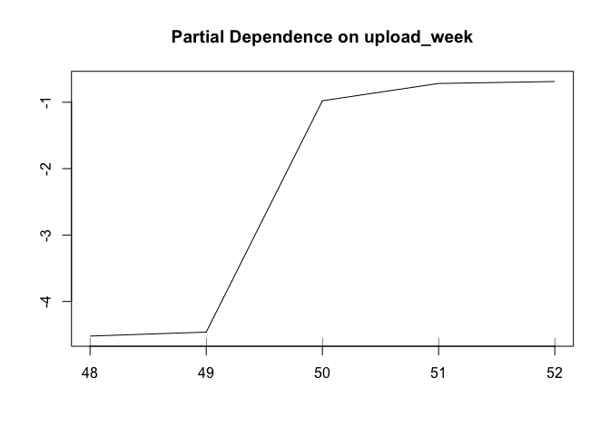<!-- -->

The variable importance plot reveals that video length is a major factor
in predicting if the video is trending or not followed by days after
upload and video quality variables. The variable upload week is just
proxy for days after upload.

The following are the characteristics of videos that are trending up:

  - Short video lengths.

  - Newer videos are more likely to be trending than older ones. This is
    expected as videos age, they lose the novelty affect and become less
    effective at generating more views.

  - Low resolution videos (240p) have a slight higher chance of trending
    on the platform than higher resolution. This could be because lower
    resolution videos are easier to stream in low band width areas like
    streaming videos with mobiles on buses and subways.

  - German and French videos are more likely to be trending than other
    languages. This is not suprising as there are so few German and
    French videos uploaded on the site and the low supply in those
    languages could be resulting in higher proportion of Hot videos.

# Question 3:

Let us dig deep and explore relationship between video length and views.

``` r
# Bin vodeos based on the video length
data <- data %>%
  mutate(video_length_type = case_when(video_length > 0 & video_length <= 300 ~ "0-5 mins",
                                  video_length > 300 & video_length <= 600 ~ "05-10 mins",
                                  video_length > 600 & video_length <= 900 ~ "10-15 mins",
                                  TRUE  ~ "15+ mins")
         )

data %>%
  group_by(video_length_type) %>%
  summarise(avg_views_per_day_per_video = mean(avg_views_per_day)) %>%
ggplot() +
  geom_col(aes(x = video_length_type, y = avg_views_per_day_per_video))
```

<!-- -->

The above plot shows that long videos (15+ mins duration) are generating
far lower number of views than short ones (less than 10 min duration)
and average views per day is lower by more than 35%. Also,The partial
dependence plots reveal that short videos are more likely to be trending
than longer ones.

From the product stand point, Here are some recommendations:

  - The company should investigate why there are so few German and
    French videos uploaded. This could be due to some translation
    problems in the upload process or is it something else.

  - Clearly, it appears that lengthy videos are generating far fewer
    views and are less likely to be trending than short ones. So, The
    Company should encourage video creators to make short ones with
    engaging content. They could consider creating a seperate “short
    video” section with a limit on duration of video being uploaded
    somewhere between 5-10 mins. The company should commission studies
    on what the optimum allowable video length should be for the short
    video section.

  - The company could also consider an approach to prompt users with a
    pop up telling the user that videos shorter than 10 mins are more
    likely to generate more views. If user is uploading really long
    videos then forbidding from uploading video to platform.
