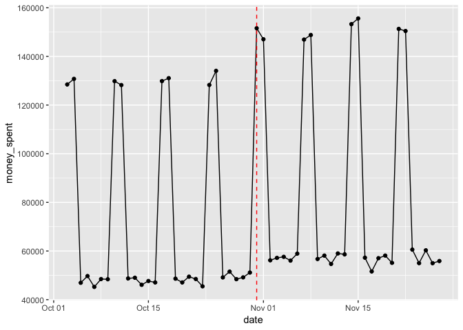
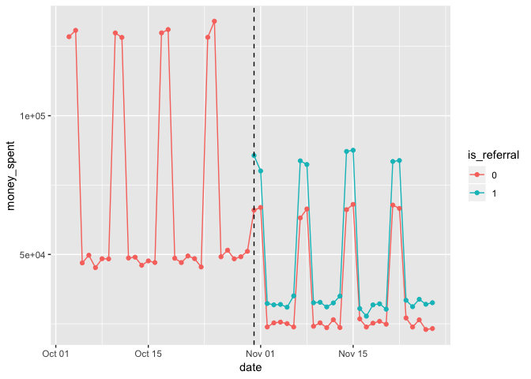

User Referral Program
================
Siddhartha Jetti
10/12/2019

# Goal

Almost all sites have a user referral program: you can invite new users
to try a given product. Typically, after the new user completes a
transaction, you get rewarded with a certain amount of money or credit
to be used on the site.

The goal of this challenge is to analyze the data from a referral
program and draw conclusions about its effectiveness.

# Challenge Description

Company XYZ has started a new referral program on Oct, 31. Each user who
refers a new user will get 10$ in credit when the new user buys
something.

The program has been running for almost a month and the Growth Product
Manager wants to know if it’s been successful. She is very excited
cause, since the referral program started, the company saw a spike in
number of users and wants you to be able to give her some data she can
show to her boss.

  - Can you estimate the impact the program had on the site?
  - Based on the data, what would you suggest to do as a next step?
  - The referral program wasn’t really tested in a rigorous way. It
    simply started on a given day for all users and you are drawing
    conclusions by looking at the data before and after the test
    started. What kinds of risks this approach presents? Can you think
    of a better way to test the referral program and measure its impact?

# Data

We have one dataset “referral.csv”

### Columns:

  - user\_id : the id of the user
  - date : date of the purchase
  - country : user country based on ip address
  - money\_spent : how much the item bought costs (in USD)
  - is\_referral : whether the user came from the referral program(1) or
    not (0)
  - device\_id : It is an identifier of the device used to make the
    purchase. You can assume here that for a given device, its id never
    changes

# Problem Setup

``` r
# Load required libraries
library(tidyverse)
```

    ## Registered S3 methods overwritten by 'ggplot2':
    ##   method         from 
    ##   [.quosures     rlang
    ##   c.quosures     rlang
    ##   print.quosures rlang

    ## ── Attaching packages ──────────────────────────────────────────────────────────────────────────── tidyverse 1.2.1 ──

    ## ✔ ggplot2 3.1.1     ✔ purrr   0.3.2
    ## ✔ tibble  2.1.1     ✔ dplyr   0.8.1
    ## ✔ tidyr   0.8.3     ✔ stringr 1.4.0
    ## ✔ readr   1.3.1     ✔ forcats 0.4.0

    ## ── Conflicts ─────────────────────────────────────────────────────────────────────────────── tidyverse_conflicts() ──
    ## ✖ dplyr::filter() masks stats::filter()
    ## ✖ dplyr::lag()    masks stats::lag()

``` r
library(ggplot2)

# Read in the input data into a dataframe
data <- read.csv("referral.csv", stringsAsFactors = F)
```

# Data Exploration

Explore data

``` r
# Check datatypes of all the variables in the dataset
str(data)
```

    ## 'data.frame':    97341 obs. of  6 variables:
    ##  $ user_id    : int  2 3 6 7 7 10 17 19 19 19 ...
    ##  $ date       : chr  "2015-10-03" "2015-10-03" "2015-10-03" "2015-10-03" ...
    ##  $ country    : chr  "FR" "CA" "FR" "UK" ...
    ##  $ money_spent: int  65 54 35 73 35 36 25 69 17 29 ...
    ##  $ is_referral: int  0 0 0 0 0 0 0 0 0 0 ...
    ##  $ device_id  : chr  "EVDCJTZMVMJDG" "WUBZFTVKXGQQX" "CBAPCJRTFNUJG" "PRGXJZAJKMXRH" ...

``` r
summary(data)
```

    ##     user_id          date             country           money_spent    
    ##  Min.   :    1   Length:97341       Length:97341       Min.   : 10.00  
    ##  1st Qu.: 2020   Class :character   Class :character   1st Qu.: 27.00  
    ##  Median : 4053   Mode  :character   Mode  :character   Median : 42.00  
    ##  Mean   : 6355                                         Mean   : 44.69  
    ##  3rd Qu.:10286                                         3rd Qu.: 59.00  
    ##  Max.   :20000                                         Max.   :220.00  
    ##   is_referral      device_id        
    ##  Min.   :0.0000   Length:97341      
    ##  1st Qu.:0.0000   Class :character  
    ##  Median :0.0000   Mode  :character  
    ##  Mean   :0.2878                     
    ##  3rd Qu.:1.0000                     
    ##  Max.   :1.0000

The range of each of the variables appear reasonable without any
non-sensical values.

``` r
# check for any missing values in the dataset
colSums(is.na(data))
```

    ##     user_id        date     country money_spent is_referral   device_id 
    ##           0           0           0           0           0           0

No missing values exist in the dataset.

Run descriptive stats on the dataset.

``` r
# Total revenue by date
data %>%
  mutate(is_referral = as.factor(is_referral), date = as.Date(date)) %>%
  ggplot(aes(x = date, y  = money_spent)) +
  stat_summary(fun.y=sum, geom="line") +
  stat_summary(fun.y=sum, geom="point") +
  geom_vline(xintercept = as.Date("2015-10-31"), linetype = "dashed", color = "red")
```

<!-- -->

The above plot shows a jump in daily sales after the referral program is
launched on Oct 31st (dashed line in the plot).

``` r
# Split revenue between users from referrals and non=referred users
data %>%
  group_by(is_referral) %>%
  summarise(unique_users = n_distinct(user_id), total_sales = sum(money_spent), revenue_per_user = sum(money_spent)/n_distinct(user_id))
```

    ## # A tibble: 2 x 4
    ##   is_referral unique_users total_sales revenue_per_user
    ##         <int>        <int>       <int>            <dbl>
    ## 1           0        11951     3034612             254.
    ## 2           1        12715     1315787             103.

``` r
# Total revenue split between referrals and non-referrals
data %>%
  mutate(is_referral = as.factor(is_referral), date = as.Date(date)) %>%
  ggplot(aes(x = date, y  = money_spent, color = is_referral)) +
  stat_summary(fun.y=sum, geom="line") +
  stat_summary(fun.y=sum, geom="point") +
  geom_vline(xintercept = as.Date("2015-10-31"), linetype = "dashed", color = "black")
```

<!-- -->

The above plot reveals that daily sales from users, who came from
referrals, are helping the overall sales after the launch of program.
However, due to the way the experiment is set up, the jump in sales
cannot be attributed to the referral program.

# Question 1:

Can you estimate the impact the program had on the site?

Here I plan to use daily sales as the metric to assess the impact of
referral program. It is easy to think of other metrics like number of
users who made atleast one purchase, money spent per purchase etc. At
the end of day, total revenue is much more meaningful metric than
others.

Summarize the data by date to get the daily sales.

``` r
data_daily <- data %>%
  group_by(date) %>%
  summarise(daily_sales = sum(money_spent))

data_daily
```

    ## # A tibble: 56 x 2
    ##    date       daily_sales
    ##    <chr>            <int>
    ##  1 2015-10-03      128475
    ##  2 2015-10-04      130772
    ##  3 2015-10-05       46946
    ##  4 2015-10-06       49711
    ##  5 2015-10-07       45242
    ##  6 2015-10-08       48463
    ##  7 2015-10-09       48389
    ##  8 2015-10-10      129837
    ##  9 2015-10-11      128229
    ## 10 2015-10-12       48712
    ## # … with 46 more rows

Compare the daily sales before and after the launch of referral program.
This is done by running T-test on daily sales and check if the
difference is statistically
significant.

``` r
t.test(data_daily$daily_sales[data_daily$date < as.Date("2015-10-31")], data_daily$daily_sales[data_daily$date >= as.Date("2015-10-31")])
```

    ## 
    ##  Welch Two Sample t-test
    ## 
    ## data:  data_daily$daily_sales[data_daily$date < as.Date("2015-10-31")] and data_daily$daily_sales[data_daily$date >= as.Date("2015-10-31")]
    ## t = -1.1138, df = 53.026, p-value = 0.2704
    ## alternative hypothesis: true difference in means is not equal to 0
    ## 95 percent confidence interval:
    ##  -33770.245   9655.459
    ## sample estimates:
    ## mean of x mean of y 
    ##  71657.00  83714.39

The T-test suggests that the difference in daily sales before and after
the launch of program is not statistically significant.

Check the performance of referral program across different user
segments.

``` r
# Compute average daily sales for each country
data_daily_country <- data %>%
  mutate(before_after_launch = ifelse(date < as.Date("2015-10-31"), "Before Launch", "After Launch"),
         country = as.factor(country)) %>%
  group_by(date, country, before_after_launch) %>%
  summarise(daily_sales = sum(money_spent)) %>%
  group_by(country) %>%
  summarise( avg_diff_daily_sales = mean(daily_sales[before_after_launch == "Before Launch"]) - mean(daily_sales[before_after_launch == "After Launch"]),
             p_value = t.test(daily_sales[before_after_launch == "Before Launch"], daily_sales[before_after_launch == "After Launch"])$p.value)

data_daily_country
```

    ## # A tibble: 9 x 3
    ##   country avg_diff_daily_sales p_value
    ##   <fct>                  <dbl>   <dbl>
    ## 1 CA                     -412   0.703 
    ## 2 CH                      512.  0.0139
    ## 3 DE                     1843.  0.163 
    ## 4 ES                    -2012.  0.0750
    ## 5 FR                    -3250.  0.0637
    ## 6 IT                    -2542.  0.0515
    ## 7 MX                    -2058.  0.0193
    ## 8 UK                    -2983.  0.0970
    ## 9 US                    -1156.  0.498

The difference in average daily sales before and after launch are
statistically significant for Mexico MX and China CH. However, sales are
better after launch in MX and worse in CH.

``` r
# Plot average daily sales Vs Country
data %>%
  mutate(before_after_launch = ifelse(date < as.Date("2015-10-31"), "Before Launch", "After Launch"),
         country = as.factor(country)) %>%
  group_by(date, country, before_after_launch) %>%
  summarise(daily_sales = sum(money_spent)) %>%
  group_by(country, before_after_launch) %>%
  summarise(avg_daily_sales = mean(daily_sales)) %>%
  ggplot(aes(x = country, y  = avg_daily_sales, color = before_after_launch, group = before_after_launch)) +
  geom_line() +
  geom_point()
```

<!-- -->

The above plot reveals that the referral program is performing
differently across different countries. The average daily sales dropped
after the launch of program in countries like China CH and Germany DE.
While sales appear to increase in other countries after the launch.

Based on the way the experiment is set up, Any change in sales after the
launch of referral program cannot be attributed to it alone. There are
other confounding factors like seasonality or launch of some marketing
event that could be affecting the sales. In US and in some other
countries, Thanks giving (occurs in end of November every year) is one
of the major holiday season and sales are generally expected to grow and
the experiment is not controlling for the lurking variables like that.

# Question 2:

Based on the data, what would you suggest to do as a next step?

From the revenue split between referrals and non-referrals plot, It is
apparent that the sales from the non-referrals, which includes all
existing users who signed up/made purchases before Oct 31st, after
launch of the program are down significantly.

Lets check if the drop in sales from the non-referrals is significant
before and after launch of program is significant.

``` r
nonreferrals_before_vs_after <- data %>%
  mutate(before_after_launch = ifelse(date < as.Date("2015-10-31"), "Before Launch", "After Launch")) %>%
  filter(is_referral == 0) %>%
  group_by(date, before_after_launch) %>%
  summarise(daily_sales = sum(money_spent))

t.test(nonreferrals_before_vs_after$daily_sales[nonreferrals_before_vs_after$before_after_launch == "Before Launch"], nonreferrals_before_vs_after$daily_sales[nonreferrals_before_vs_after$before_after_launch == "After Launch"])
```

    ## 
    ##  Welch Two Sample t-test
    ## 
    ## data:  nonreferrals_before_vs_after$daily_sales[nonreferrals_before_vs_after$before_after_launch ==  and nonreferrals_before_vs_after$daily_sales[nonreferrals_before_vs_after$before_after_launch ==     "Before Launch"] and     "After Launch"]
    ## t = 4.3754, df = 40.085, p-value = 8.417e-05
    ## alternative hypothesis: true difference in means is not equal to 0
    ## 95 percent confidence interval:
    ##  18799.12 51070.88
    ## sample estimates:
    ## mean of x mean of y 
    ##     71657     36722

Clearly, T-test suggests that the difference in sales from non-referrals
before and after the launch of program is statistically significant.

It is quite possible that new program is cannibalizing sales from the
existing users. Lets check if that is the case.

``` r
# Check if multiple users are using same device
counts_deviceid <- data %>%
  group_by(device_id) %>%
  summarise(n_users = n_distinct(user_id), referral_types = n_distinct(is_referral)) %>%
  arrange(desc(referral_types))

counts_deviceid
```

    ## # A tibble: 17,887 x 3
    ##    device_id     n_users referral_types
    ##    <chr>           <int>          <int>
    ##  1 AAEIJZQUXUETO       1              2
    ##  2 AAFWFCPHRVTTE       2              2
    ##  3 AALHUFWNVROUD       2              2
    ##  4 AANBNDYFXDDTU       2              2
    ##  5 AANMQLIXUDKFJ       2              2
    ##  6 AAPOSGLGOGVMI       2              2
    ##  7 AAUOIIUZHHWTL       1              2
    ##  8 ABABAWCOLPZXO       2              2
    ##  9 ABADIUGCJRDOV       2              2
    ## 10 ABAPCEOKZCDAH       1              2
    ## # … with 17,877 more rows

``` r
# Are new referred users coming from existing devices
referrals_using_existing_devices <- data %>%
  filter(device_id %in% counts_deviceid$device_id[counts_deviceid$referral_types > 1], is_referral == 1) %>%
  select(user_id) %>%
  distinct()

nrow(referrals_using_existing_devices)
```

    ## [1] 8571

There are about 8571 users that were showing up as new referrals, but
were using devices seen earlier. Clearly, users are referring themselves
or members of same family.

Although it appears that sales have increased after launch, The new
program is cannibalizing the sales from the existing users. Users are
simply creating new accounts and referring themselves or members of
family to take advantage of the $10 credit for a new referral. The jump
in sales we witnessed after launch could very well have happened even if
the program would not have launched.

### Next Steps :

The company should come up with a robust way to test the referral
program that controls for unwanted confounders. If they decide to launch
the referral program, They should look into ways to prevent the abuse of
program by restricting number new user sign-ups from a single device.

# Question 3:

The referral program wasn’t really tested in a rigorous way. It simply
started on a given day for all users and you are drawing conclusions by
looking at the data before and after the test started. What kinds of
risks this approach presents? Can you think of a better way to test the
referral program and measure its impact?

The way the referral program was tested is faulty. The experimental set
up is not accounting for the seasonal nature of sales and there could be
confounding variables in play that affect the sales. This approach poses
the risk of false positive, concluding that the new program is causing
the jump in sales when in fact it is not.

A better way to test the referral program is Testing by Markets. Metric
: Average Daily sales

### Experimental Setup :

  - Identify the pairs of markets or zones that have similar sales and
    demographic characteristics by looking at the historical data.
  - Estimate the sample size (number of days) needed to detect the
    expected effect size.
  - Now among the similar pair, randomly select one to be test group and
    launch the referral program. The other will be the control group.
  - Run the test at the sametime for both test and contol groups until
    required sample size is reached. Running the test at the sametime is
    critical to control for the seasonality and other confounders.
  - Check if difference in sales is significant using a T-test.
